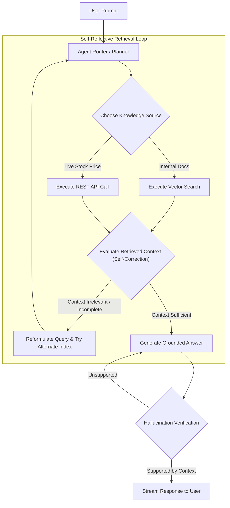

# Agentic RAG: Self-Reflective Retrieval Architecture

## 1. Moving from Static Chains to Dynamic Loops

In traditional RAG, retrieval is a static one-shot action: the system queries the index once and attempts to generate an answer, even if the retrieved context is irrelevant or empty.

**Agentic RAG** treats retrieval as a set of tools invoked by an autonomous reasoning agent capable of **evaluating retrieval quality, reformulating queries upon failure, and deciding when enough information exists to respond**.

---

## 2. Production Guardrails for Agentic RAG
* **Maximum Iteration Bounding**: Restrict the agent loop to a maximum of 3 retrieval iterations to prevent infinite retry loops.
* **Deterministic Fallback**: If the agent fails to find relevant information after 3 attempts, terminate gracefully: *"I could not find verified documentation to answer your request."*
