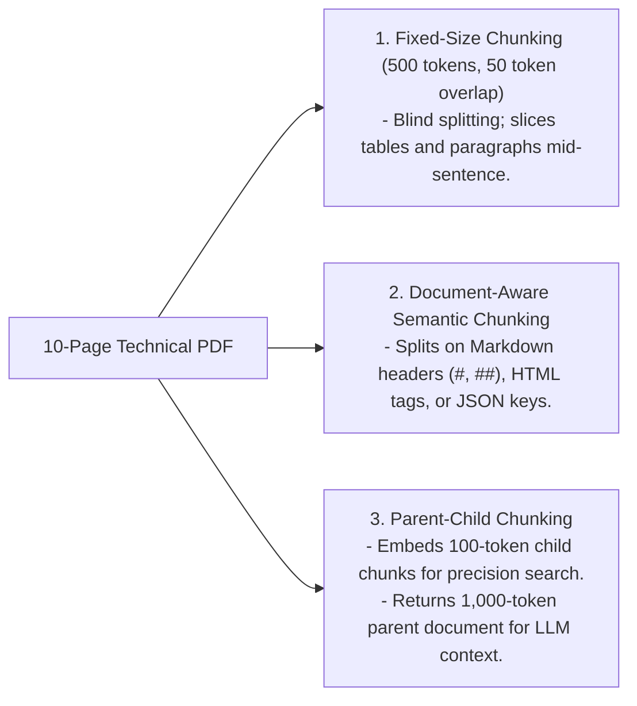

# Document Parsing & Chunking Strategies

## 1. The Impact of Chunking on Retrieval Quality

Chunking is the process of partitioning large unstructured documents into discrete text blocks for embedding and retrieval. **Chunking strategy dictates retrieval performance**:
* **Chunks too small (e.g., 50 tokens)**: High semantic specificity, but lacks surrounding context; LLM cannot synthesize complete answers.
* **Chunks too large (e.g., 2,000 tokens)**: High context coverage, but dilutes vector embeddings; nearest-neighbor search misses subtle facts.

---

## 2. Chunking Strategies Compared

| Strategy | Splitting Logic | Pros | Cons | Ideal Use Case |
| :--- | :--- | :--- | :--- | :--- |
| **Fixed-Size with Overlap** | Fixed token count (e.g., 512 tokens with 64 overlap). | Trivial to implement; highly predictable memory usage. | Slices sentences, tables, and code blocks in half. | Baseline prototype; uniform raw text. |
| **Markdown / Structural** | Splits along markdown headers (`#`, `##`, `###`). | Preserves complete logical sections and topics. | Variable chunk sizes; some sections may be too large. | Technical documentation, user manuals, wikis. |
| **Semantic Similarity** | Computes sliding cosine distance between adjacent sentences; splits when distance spikes. | Ensures each chunk discusses a single coherent topic. | Computationally expensive; requires embedding every sentence. | Dense academic papers, legal transcripts. |
| **Parent-Child** | Small child chunks (128 tokens) linked to parent block (1024 tokens). | High retrieval precision combined with rich LLM context. | Requires relational metadata tracking in vector DB. | Enterprise policy manuals, complex contracts. |
