# GraphRAG: Graph-Augmented RAG Architecture

## 1. The Vector Search Blindspot: Global Questions

Standard vector search excels at local, needle-in-a-haystack queries (*"What is the deductible for Policy 401?"*). However, vector search **completely fails at global, holistic questions** (*"What are the top 5 emerging risk themes across all corporate contracts signed in 2025?"*), because no single chunk contains the comprehensive answer.

**GraphRAG** extracts entities and relationships from documents, builds a **Knowledge Graph**, clusters related nodes into hierarchical communities, and pre-generates summaries for each community.

```mermaid
flowchart TD
    subgraph Indexing ["1. Offline Graph Construction Pipeline"]
        RawDocs["Unstructured Enterprise Documents"] --> LLMExtract["LLM Entity & Relationship Extractor"]
        LLMExtract --> GraphDB[("Knowledge Graph (Neo4j / Amazon Neptune)\nNodes: Entities | Edges: Relationships")]
        GraphDB --> Community["Leiden Graph Community Detection"]
        Community --> Summarizer["LLM Community Summarizer\n(Generates holistic summaries for every cluster)"]
        Summarizer --> SummaryIndex[("Vector Index of Community Summaries")]
    end

    subgraph QueryExecution ["2. Global Query Execution"]
        GlobalQ["Global Query: 'Summarize risk themes across all contracts'"] --> SearchSummaries["Search Community Summaries"]
        SearchSummaries --> SynthesizeGlobal["Map-Reduce LLM Synthesis"]
        SynthesizeGlobal --> FinalSummary["Comprehensive Enterprise Risk Report"]
    end
```

---

## 2. When to Use GraphRAG
* **Use GraphRAG for**: Comprehensive document corpus summarization, interconnected entity discovery (supply chain disruptions, fraud syndicates, regulatory compliance audits).
* **Do NOT Use GraphRAG for**: Simple high-volume FAQ chatbots where sub-second latency and low token costs are mandatory.
