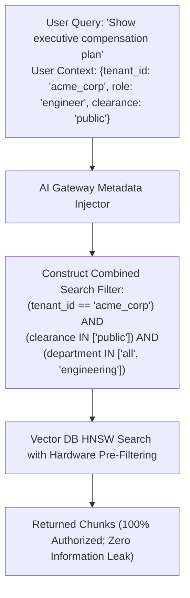

# Metadata Filtering & Multi-Tenant RAG Architecture

## 1. Eliminating Cross-Tenant Data Leaks

In enterprise applications, search relevance is subordinate to **access control**: a user must never retrieve documents they lack permission to view, regardless of semantic similarity.

Multi-Tenant RAG integrates security metadata directly into the vector indexing and retrieval lifecycle.

---

## 2. Pre-Filtering vs. Post-Filtering

### 2.1 Post-Filtering (Anti-Pattern)
* Execute vector search across the entire global index to retrieve top 50 matches; then filter out unauthorized chunks in application code.
* **Catastrophic Failure**: If the top 50 matches all belong to other tenants, the user receives **zero results**, even though valid documents exist further down the index.

### 2.2 Pre-Filtering (Production Invariant)
* Vector search engines (Qdrant, Milvus, pgvector, Pinecone) apply Boolean metadata filters *during* the graph traversal phase (HNSW). The search space is strictly bounded to the user's authorized partition before distance calculations occur.
