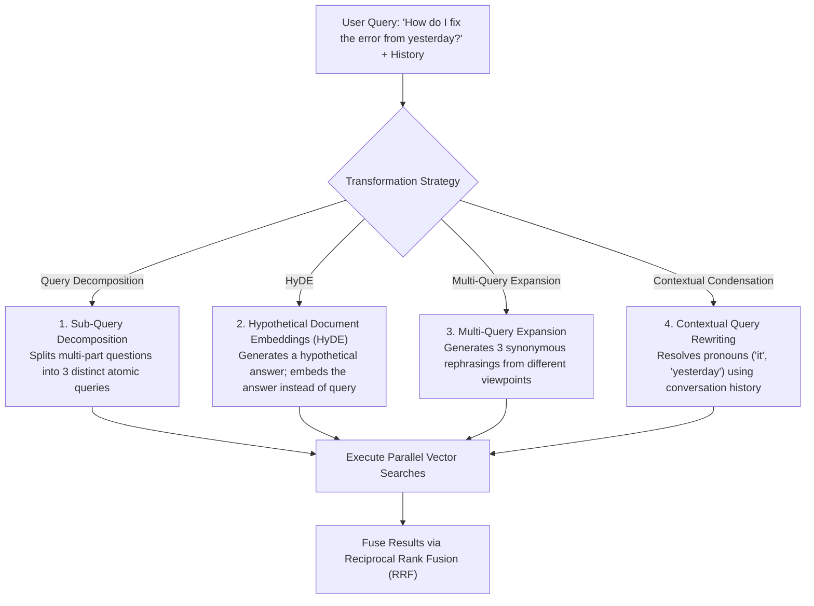

# Query Transformation & Rewriting Architecture

## 1. The Gap Between User Queries and Enterprise Documents

End-user queries are frequently ambiguous, poorly phrased, incomplete, or conversational (e.g., *"How do I fix the error from yesterday?"*). Ingested enterprise documents, conversely, are written in formal, highly specific technical terminology.

**Query Transformation** bridges this semantic gap before vector retrieval begins.

---

## 2. Hypothetical Document Embeddings (HyDE) Deep-Dive
* **Concept**: User query vectors and document chunk vectors occupy different regions in embedding space (questions look like questions; documents look like answers).
* **Execution**: Prompt an ultra-fast small model (e.g., GPT-4o-mini) to hallucinate a hypothetical paragraph answering the user's query. Embed the *hypothetical paragraph* and use that vector to search the database.
* **Advantage**: The hypothetical document's embedding resides in the exact same dense space as real documents, yielding up to 30% higher retrieval precision.
