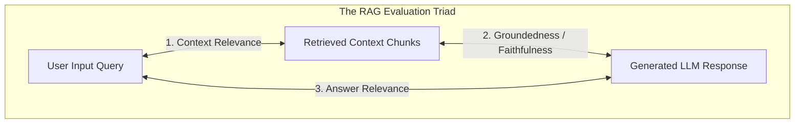

# RAG Evaluation Architecture & The RAG Triad

## 1. The Core Metrics of Retrieval-Augmented Generation

To evaluate an enterprise RAG system objectively without human labor, modern architecture implements the **RAG Triad** (formalized by frameworks like Ragas and TruLens):

---

## 2. Detailed Metric Formulations

### 2.1 Faithfulness (Groundedness)
* **What it measures**: Does the response contain claims that are NOT supported by the retrieved context? (Measures hallucination rate).
* **Calculation**: 
  $$\text{Faithfulness} = \frac{\text{Number of verifiable claims in response supported by context}}{\text{Total number of claims in response}}$$
* **Production Threshold**: $\ge 0.95$. Any production prompt change that reduces faithfulness must be rejected in CI/CD.

### 2.2 Answer Relevance
* **What it measures**: Does the response directly address the user's specific prompt, or does it ramble into tangential information?
* **Calculation**: Generate hypothetical queries from the response and compute cosine similarity against the original query.
* **Production Threshold**: $\ge 0.88$.

### 2.3 Context Relevance
* **What it measures**: Did the retrieval engine fetch clean, precise chunks, or did it flood the LLM context with noisy, irrelevant paragraphs?
* **Calculation**: Proportion of retrieved sentences that directly contribute to formulating the answer.
* **Production Threshold**: $\ge 0.75$.
