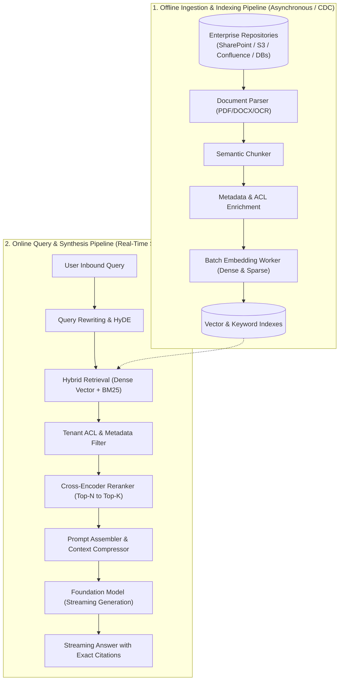

# Enterprise RAG Pipeline Architecture

## 1. The Multi-Tier End-to-End Pipeline

An enterprise RAG system is not a single script; it is a decoupled, multi-tier distributed pipeline composed of an **Offline Ingestion & Indexing Pipeline** and an **Online Real-Time Retrieval & Synthesis Pipeline**:

---

## 2. Pipeline SLAs & Latency Budgeting

| Pipeline Stage | Target Latency | Architectural Strategy |
| :--- | :--- | :--- |
| **Query Rewriting / HyDE** | $50\text{ms} - 150\text{ms}$ | Small, fast model (8B parameter) or local CPU ONNX runtime. |
| **Vector & BM25 Retrieval**| $15\text{ms} - 40\text{ms}$ | Parallel async RPCs; HNSW index residing in-memory. |
| **Cross-Encoder Reranking**| $40\text{ms} - 100\text{ms}$ | Rerank only top 30 candidates to select top 5; GPU batch inference. |
| **LLM Generation (TTFT)** | $300\text{ms} - 600\text{ms}$ | High-performance serving engine (vLLM / TensorRT-LLM). |
| **Total P99 Latency** | $< 1,000\text{ms}$ | Strict timeout budgets per stage with fallback defaults. |
