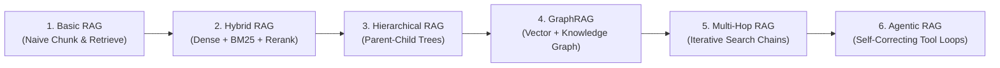

# RAG Architectural Variants Comparison

## 1. Architectural Taxonomy of Modern RAG

Retrieval-Augmented Generation has evolved far beyond the naive "chunk-embed-search" paradigm. Enterprise architects must select from six distinct RAG patterns based on query complexity and domain constraints:

---

## 2. Multi-Dimensional Comparison Matrix

| Variant | Architectural Complexity | Primary Advantage | Latency Profile | Ideal Enterprise Use Case |
| :--- | :--- | :--- | :--- | :--- |
| **Basic RAG** | Low (Single vector search). | Minimal operational overhead; fast to deploy. | Fast (< 600ms) | Simple factual FAQs, single-topic knowledge bases. |
| **Hybrid RAG** | Medium (Vector + BM25 + Cross-Encoder). | Catches exact keyword matches (IDs, error codes) + concepts. | Fast (< 800ms) | **Production enterprise baseline** for search and customer support. |
| **Hierarchical RAG** | Medium (Tree-based chunk relationships). | High search precision; broad LLM context preservation. | Fast (< 700ms) | Complex legal contracts, regulatory compliance manuals. |
| **GraphRAG** | High (Vector DB + Neo4j Graph + LLM clustering). | Synthesizes global holistic summaries across thousands of documents. | High (2s - 10s) | Executive strategy analysis, fraud network discovery. |
| **Multi-Hop RAG** | High (Iterative retrieval based on intermediate answers). | Answers questions requiring deductive link traversal across documents. | High (3s - 8s) | Financial auditing, intelligence analysis, forensic investigations. |
| **Agentic RAG** | Very High (Autonomous agent dynamically reformulates queries). | Self-healing; evaluates retrieval quality and corrects failures. | Variable (2s - 15s) | Complex technical troubleshooting, autonomous research assistants. |
