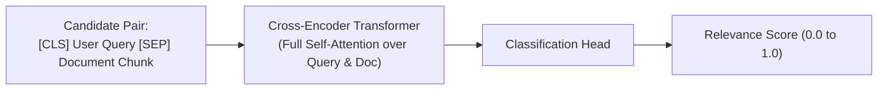

# Cross-Encoder Reranking Architecture

## 1. Why Rerankers Outperform Vector Search

In vector search, the query vector and document vector are computed independently, preventing any interaction between individual query words and document words during encoding.

A **Cross-Encoder Reranker** passes the query and candidate document together into a full transformer network, allowing every query token to attend to every document token via full cross-attention.

---

## 2. Production Invariants
* **Sizing the Candidate Pool**: Never send more than 30–50 candidate documents to a reranker in real-time pipelines. Reranking 100+ documents introduces unacceptable latency ($> 250\text{ms}$).
* **Score Thresholding**: If the top-ranked document from the reranker scores below a confidence threshold (e.g., score $< 0.40$), terminate the pipeline gracefully to prevent hallucinations on irrelevant context.
