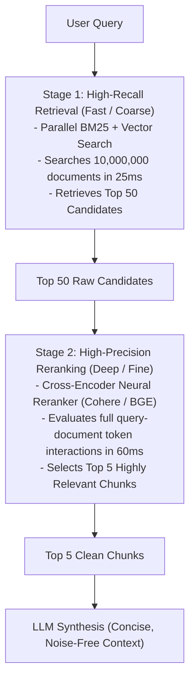

# Two-Stage Retrieval Pipeline Architecture

## 1. High-Precision Retrieval Topology

---

## 2. Performance & Quality Impact
Empirical testing across enterprise datasets demonstrates that introducing a second-stage Cross-Encoder reranker **boosts RAG answer accuracy by 25%–35%** while keeping total retrieval latency under $100\text{ms}$.
