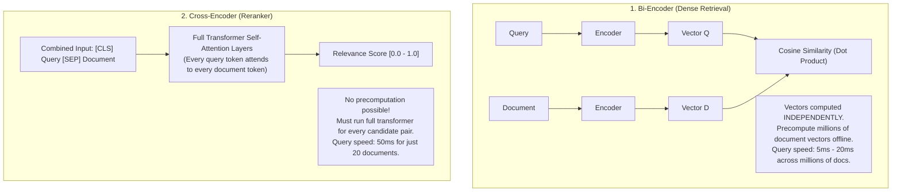

# Bi-Encoders vs. Cross-Encoders in Search Architecture

## 1. The Fundamental Trade-Off: Speed vs. Interaction

---

## 2. Architectural Conclusion: The Two-Stage Pipeline
Never use Cross-Encoders for initial retrieval across a full database. Always use a **Bi-Encoder** to rapidly retrieve the top 50 candidates from millions of documents, then use a **Cross-Encoder** as a second-stage reranker on those 50 candidates.
