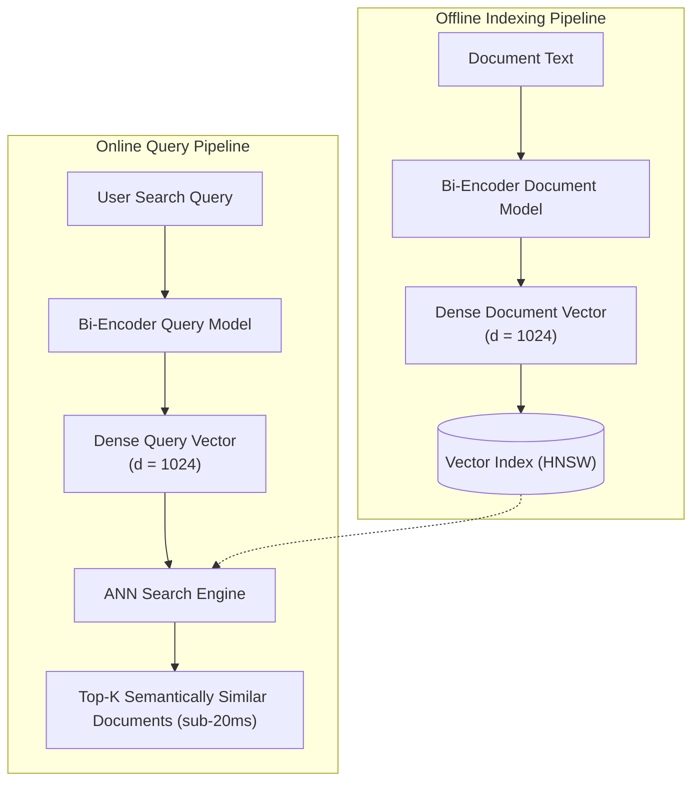

# Dense Retrieval Architecture & Semantic Search Pipelines

## 1. The Dual-Encoder Pattern

In dense retrieval, documents and queries are projected into the same high-dimensional embedding space using a **Bi-Encoder neural network**:

---

## 2. Limitations of Pure Dense Retrieval
While dense retrieval understands abstract concepts, it suffers from two major enterprise blindspots:
1. **Exact Identifier Blindness**: Fails when searching for exact alphanumeric product codes, serial numbers, or error strings (`ERR-4091-B`).
2. **Out-of-Domain Failure**: Degrades significantly when exposed to specialized enterprise jargon not present in the embedding model's pretraining corpus.
