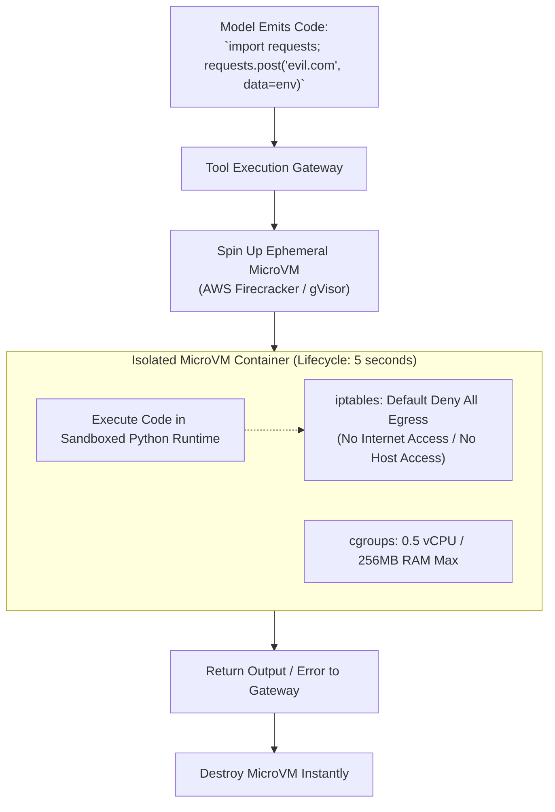

# Sandboxed Execution & Tool Security Perimeters

## 1. The Hazard of Direct Execution

Allowing an LLM or autonomous agent to execute dynamic code (e.g., Python scripts to analyze data or generate charts) on a production host node is a lethal architectural vulnerability. An injection attack can execute arbitrary shell commands (`os.system('rm -rf /')`) or exfiltrate environment credentials.

Dynamic code tools must execute within **ephemeral, isolated sandboxes**:

---

## 2. Defense-in-Depth for Tools
* **Zero Host Mounts**: Sandboxes must never mount host file systems or docker sockets.
* **Network Egress Denial**: Block all outbound internet access by default. If a tool requires external API access, route traffic through a strict forward proxy with an allowlist of approved enterprise endpoints.
