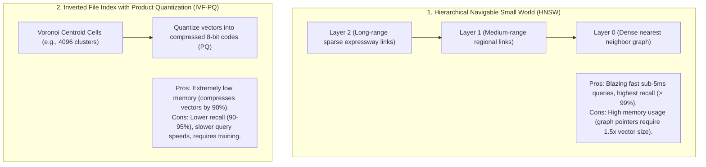

# Approximate Nearest Neighbor (ANN) Algorithms: HNSW vs. IVF

## 1. The $O(N)$ Exact Search Bottleneck

Finding the exact nearest neighbor to a query vector requires computing distance against every single vector in the database (Flat Search):
$$\text{Complexity} = O(N \times d)$$
Across 10,000,000 vectors, exact search takes seconds and is completely unusable for interactive applications. **Approximate Nearest Neighbor (ANN)** algorithms trade a minute fraction of recall accuracy ($< 1\%$) for a **1,000x latency reduction**.

---

## 2. HNSW vs. IVF-PQ

### Architectural Recommendation
Use **HNSW** for systems with $< 10\text{M}$ vectors where query speed and maximum accuracy are critical. Use **IVF-PQ** or scalar-quantized HNSW (SQ-HNSW) when scaling to tens of millions of vectors under strict RAM budgets.
