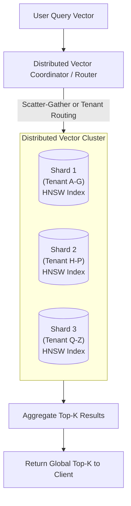

# Scaling & Sharding Distributed Vector Indexes

## 1. Horizontal Sharding Topologies

When a vector index exceeds single-node memory capacity ($\sim 128\text{GB}$ RAM), the index must be horizontally partitioned across multiple nodes:

---

## 2. Partitioning Strategies
* **Tenant-Based Routing**: If every query includes `tenant_id`, partition shards by tenant. The router routes directly to a single shard, achieving linear scaling with zero cross-node scatter-gather overhead.
* **Random Hash Partitioning**: Used when queries search the global document corpus. The coordinator scatters the query vector across all shards in parallel, receives the top-$K$ candidates from each, and performs an in-memory merge-sort to extract the final global top-$K$.
