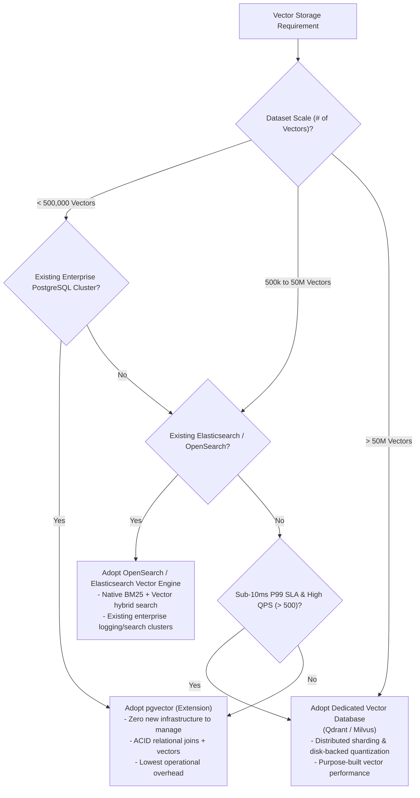

# Vector Storage Decision Framework

## 1. Architectural Selection Scorecard

---

## 2. Multi-Engine Comparative Matrix

| Dimension | PostgreSQL + `pgvector` | Elasticsearch / OpenSearch | Dedicated Vector DB (Qdrant / Milvus) |
| :--- | :--- | :--- | :--- |
| **Max Practical Scale** | Up to 1–2 Million vectors. | Up to 50 Million vectors. | Hundreds of Millions to Billions. |
| **Operational Overhead** | Zero (reuses existing DB). | Low (reuses search cluster). | Medium to High (new cluster, new SRE runbooks). |
| **Relational Joins** | **Native SQL Joins** (`WHERE user_id = ...`). | Filter context queries. | Metadata payload filtering only. |
| **Hybrid Search** | Requires manual text index combine. | **Native BM25 + Vector in one query**. | Requires reciprocal rank fusion middleware. |
| **P99 Query Latency** | $25\text{ms} - 80\text{ms}$ | $15\text{ms} - 50\text{ms}$ | **$< 10\text{ms}$** |
| **Cost Profile** | Lowest (amortized into existing DB). | Medium. | High (dedicated memory-intensive instances). |
