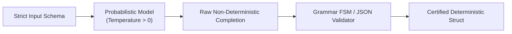

# Probabilistic Data Flows Architecture

## 1. Managing Stochastic Transitions

When data passes through an AI model, the output schema and semantic content are probabilistic:
$$X_{\text{deterministic}} \xrightarrow{\text{LLM}} \hat{Y}_{\text{probabilistic}} \xrightarrow{\text{Grammar / Guardrail}} Y_{\text{deterministic}}$$

