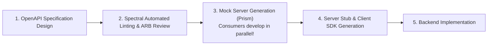

# API-First Design & Governance Architecture

## 1. Design-First vs. Code-First

In code-first development, developers write code and auto-generate API documentation as an afterthought, leading to inconsistent schemas, leaky database abstractions, and frequent breaking changes.

**Design-First** mandates that the API contract (OpenAPI 3.1 YAML) is designed, reviewed by consumers, and validated by automated linters *before* any backend code is written:

