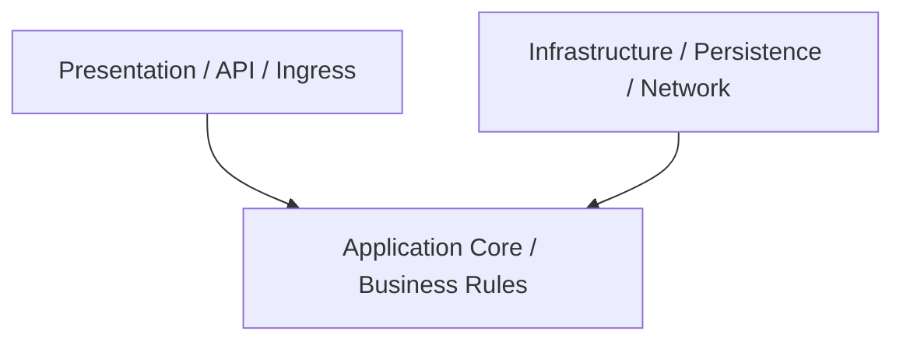

# Architectural Style: Domain-Centric Architecture

## 1. Problem & Context
Software applications that lack clear structural discipline quickly succumb to tight coupling between user interface code, business logic, and database persistence. Changing a database column forces modifications to UI controllers, and testing business logic requires running databases and web servers.

Architectural philosophy placing rich domain aggregates ahead of database or framework concerns.

---

## 2. Structural Architecture & Dependency Direction



---

## 3. Core Components & Responsibilities
- **Presentation Layer**: Handles transport, HTTP serialization, user authentication tokens, and input validation.
- **Application Core**: Orchestrates domain workflows, transactions, and use-case execution.
- **Domain Entities**: Enforces enterprise invariants and business policy.
- **Infrastructure Adapters**: Implements database queries, external REST clients, and file I/O.

---

## 4. Architectural Trade-Off Analysis

```
+--------------------------+---------------------------------+---------------------------------+
| Architectural Dimension  | Strengths                       | Trade-Offs / Costs              |
+--------------------------+---------------------------------+---------------------------------+
| Testability              | High (Core isolated via mocks)  | Requires mapping boilerplate    |
| Maintainability          | High boundary clarity           | Learning curve for junior devs  |
| Performance              | Minimal in-process overhead     | Object-to-object mapping costs  |
| Deployability            | Single-artifact simplicity      | Monolithic scaling boundaries   |
+--------------------------+---------------------------------+---------------------------------+
```

---

## 5. Testing & Operational Implications
- **Unit Testing**: Domain entities and use cases are tested with pure unit tests without databases or mocks.
- **Integration Testing**: Infrastructure adapters are tested using Testcontainers against real databases.

---

## 6. When to Use vs When NOT to Use
- **Use When**: Building enterprise domain applications with moderate-to-high business complexity and multi-year lifespans.
- **Do NOT Use When**: Building pure data passthrough services (CRUD proxies) or trivial scripts where mapping boilerplate exceeds business logic.
