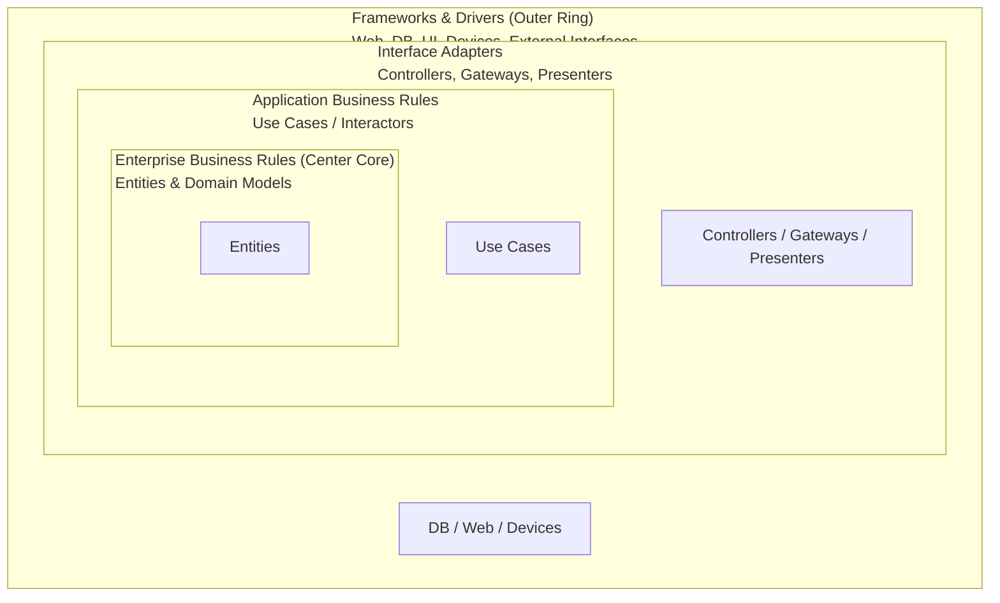
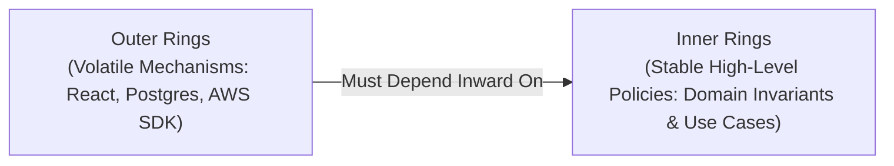
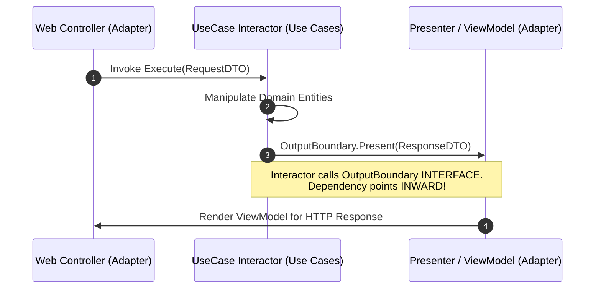

# Clean Architecture Pattern

## Overview

Clean Architecture—formulated by Robert C. Martin ("Uncle Bob") in 2012—synthesizes the core principles of Hexagonal Architecture (Ports and Adapters), Onion Architecture (Jeffrey Palermo), and Screaming Architecture into a standardized, concentric-ring architectural blueprint.

The overriding objective of Clean Architecture is to produce systems that are:
- **Independent of Frameworks**: Architecture does not depend on the existence of some library of feature-laden software.
- **Testable without UI or Database**: Business rules can be tested without the web server, database, or console.
- **Independent of the UI**: The web UI can be swapped for a mobile app or console without touching business rules.
- **Independent of the Database**: Data persistence can change without affecting business use cases.

---

## The Concentric Rings of Clean Architecture

---

## The Dependency Rule: The Golden Law

> **"Source code dependencies must point only inward, toward higher-level policies."**

Nothing in an inner ring can know anything at all about something in an outer ring:
- Entities know **nothing** about Use Cases, Controllers, or Databases.
- Use Cases know about Entities, but know **nothing** about HTTP, REST, SQL, or JSON.
- Interface Adapters know about Use Cases and Entities, but know **nothing** about web frameworks (Express, Spring, ASP.NET) or database connection strings.

---

## Ring-by-Ring Breakdown

### 1. Entities (Enterprise Business Rules)
- Encapsulate the most general, high-level business rules and domain entities (e.g., `Account`, `Loan`, `Policy`).
- An entity can be an object with methods, or a set of data structures and functions.
- Entities are completely unaffected by changes in UI, database technology, or application navigation flows.

### 2. Use Cases (Application Business Rules)
- Encapsulate and implement the specific use cases of the software system (e.g., `TransferFundsUseCase`, `RegisterUserUseCase`).
- Orchestrates the flow of data to and from the Entities, directing them to use their critical business rules to achieve the goal of the use case.
- Changes in this ring do not affect Entities. Changes to externalities (like database or framework) do not affect this ring.

### 3. Interface Adapters (Adapters & Presenters)
- Translates data from the format most convenient for use cases and entities, into the format most convenient for external agencies (database, web, mobile UI).
- Contains MVC Controllers, ViewModels, Presenters, and concrete implementations of Repositories.

### 4. Frameworks & Drivers (Infrastructure)
- The outermost ring composed of tools, frameworks, and mechanisms: database drivers (EF Core, Hibernate), web frameworks (Express, ASP.NET, Spring), and cloud SDKs.
- This layer contains minimal glue code that connects external devices to Interface Adapters.

---

## Crossing Boundaries: Interactors and Boundary DTOs

How does a Use Case send data back to the web browser without creating an outward dependency on the UI? **By using Interfaces and Data Transfer Objects (DTOs)**:

---

## Clean Architecture vs. Hexagonal vs. Onion

| Architecture Style | Origin | Core Metaphor | Key Distinctive Feature |
|:---|:---|:---|:---|
| **Hexagonal (Ports & Adapters)**| Alistair Cockburn (2005) | Hexagon with Inside vs. Outside | Driving vs. Driven Ports; framework-agnostic core |
| **Onion Architecture** | Jeffrey Palermo (2008) | Concentric onion rings | Formalized Domain Model at core with Domain Services |
| **Clean Architecture** | Robert C. Martin (2012) | Concentric circular layers | Explicitly formalized Use Cases (Interactors) and Input/Output Boundary DTOs |

All three architectures share the identical underlying goal: **Invert dependencies so business logic remains independent of external technology frameworks and databases.**
