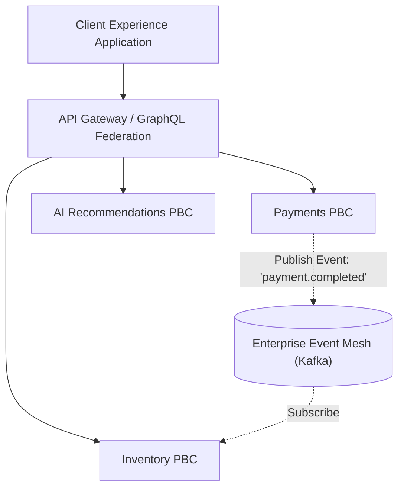

# Composable Enterprise Integration Patterns

## 1. Composition Topologies

Connecting multiple autonomous PBCs requires an integration fabric that avoids creating a centralized monolithic bottleneck:

