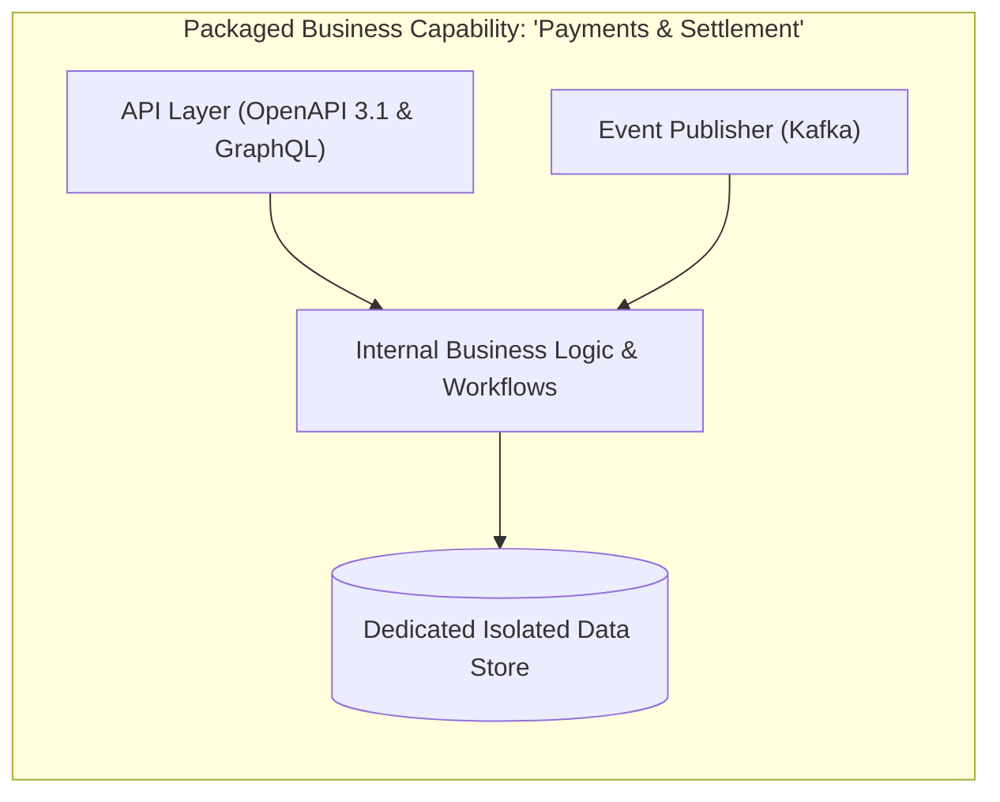

# Packaged Business Capabilities (PBCs)

## 1. Defining the Packaged Business Capability

A **Packaged Business Capability (PBC)** is a software component representing a well-defined business capability, functionally recognizable to a business user. It is completely encapsulated, independently deployable, and exposed exclusively via versioned APIs and event contracts.

---

## 2. Invariant: Zero Direct Database Access
External services must never read or write directly to a PBC's internal database. All interactions must traverse public API endpoints or subscribe to authorized event topics.
