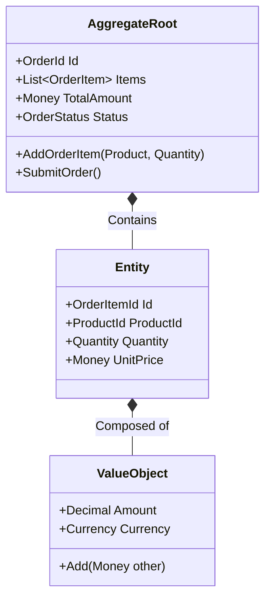

# Domain-Driven Design (DDD) Architecture Pattern

## Overview

Domain-Driven Design (DDD)—formulated by Eric Evans in his seminal 2003 book—is an architectural and software engineering methodology that prioritizes the core domain model and domain logic over technical mechanisms. In large-scale enterprise architectures, DDD bridges the semantic divide between business domain experts and software developers by establishing a shared **Ubiquitous Language** and organizing complex software estates into autonomous **Bounded Contexts**.

DDD is divided into two mutually reinforcing disciplines: **Strategic Design** (large-scale architectural boundaries and context relationships) and **Tactical Design** (code-level building blocks).

---

## 1. Strategic Domain-Driven Design

Strategic DDD guides how to carve large, complex enterprise systems into maintainable, autonomous subsystems.

```mermaid
flowchart TD
    subgraph Enterprise["Enterprise Business Estate"]
        subgraph BC_Sales["Sales Bounded Context"]
            UL1["Ubiquitous Language:<br/>Lead, Opportunity, Quote, Prospect"]
        end

        subgraph BC_Billing["Billing Bounded Context"]
            UL2["Ubiquitous Language:<br/>Invoice, LedgerEntry, PaymentMethod, TaxRate"]
        end

        subgraph BC_Shipping["Shipping Bounded Context"]
            UL3["Ubiquitous Language:<br/>Consignment, Manifest, Waybill, Carrier"]
        end
    end

    BC_Sales -.->|Context Map: Customer-Supplier| BC_Billing
    BC_Billing -.->|Context Map: Anti-Corruption Layer (ACL)| BC_Shipping
```

### Core Strategic Concepts

1. **Ubiquitous Language**: A unified, rigorous language shared between software engineers and business domain experts, used consistently in speech, design documents, and directly in source code (class names, variable names, method names).
2. **Bounded Context**: An explicit linguistic and architectural boundary within which a specific domain model applies. The word `"Customer"` means a `Prospect` in the Sales Context, a `Debtor` in the Billing Context, and a `Recipient` in the Shipping Context. Attempting to create a single unified enterprise `"Customer"` entity creates an unmaintainable architectural disaster.
3. **Context Mapping**: Formally defining the relationships between bounded contexts:
   - **Shared Kernel**: Two contexts share a small, mutually dependent subset of domain models.
   - **Customer-Supplier**: Upstream context (Supplier) delivers features required by downstream context (Customer).
   - **Conformist**: Downstream context accepts the upstream model as-is without translation.
   - **Anti-Corruption Layer (ACL)**: A translation layer that shields a downstream model from being corrupted by an upstream legacy schema.

---

## 2. Tactical Domain-Driven Design

Tactical DDD provides the code-level structural patterns for encapsulating complex domain rules inside a single Bounded Context:



### The Tactical Building Blocks

| Building Block | Nature & Mutability | Identity & Equality | Purpose / Example |
|:---|:---|:---|:---|
| **Entity** | Mutable object with a continuous lifecycle | Unique identity (`Id`) independent of attributes | `User`, `Order`, `FlightReservation` |
| **Value Object** | **Strictly Immutable** descriptor | No identity; equality based on attribute values | `Money { 50.00, USD }`, `Address`, `GeoCoordinates` |
| **Aggregate & Root** | Cluster of Entities & Value Objects treated as an atomic unit | One entity chosen as **Aggregate Root** (`Order`); outside code references ONLY the root | The root enforces all transactional invariants across the cluster |
| **Domain Event** | Immutable record of something significant that happened | Past-tense event with timestamp | `OrderPlacedEvent`, `PaymentDeclinedEvent` |
| **Domain Service** | Stateless operation spanning multiple aggregates | No identity; pure domain logic | `FundsTransferService` transferring between two `Account` aggregates |
| **Repository** | Abstraction simulating an in-memory collection of aggregates | Reconstitutes and persists full Aggregate Roots | `IOrderRepository.Save(Order order)` |

---

## The Golden Rules of Aggregate Design (Vaughn Vernon)

1. **Model True Invariants in Consistency Boundaries**: An aggregate should encompass only the entities that must be kept mutually consistent under atomic database transactions.
2. **Design Small Aggregates**: Large aggregates cause severe optimistic concurrency conflicts and memory bloat. A common anti-pattern is placing 1,000 `OrderItem` objects inside an `Order` aggregate; keep aggregates as small as possible.
3. **Reference Other Aggregates by Identity Only**: An `Order` aggregate must never hold a direct object reference to a `Customer` aggregate. It must store only the `CustomerId` (Value Object).
4. **Update Other Aggregates Using Eventual Consistency**: If modifying Aggregate A requires updating Aggregate B, execute that update asynchronously via Domain Events, not in the same database transaction.
