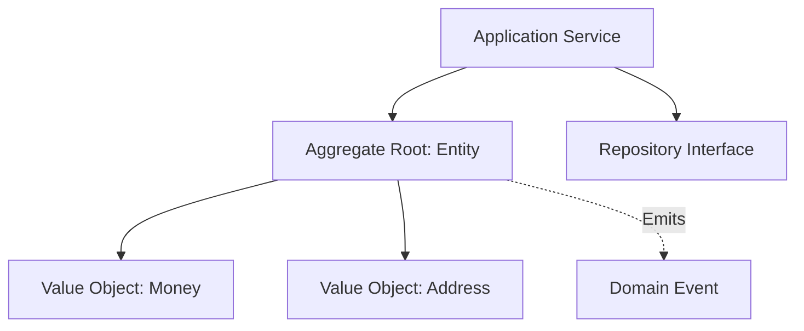

# Domain-Driven Design: Supporting Subdomains: Bespoke Additions

## 1. Problem & Context
Capabilities that support the core domain but do not provide a competitive edge. Custom-built, but requires less architectural ceremony.

---

## 2. Core Architectural Principles & Mechanics



---

## 3. Implementation Rules & Best Practices
- **Invariance Enforcement**: The Aggregate Root is the sole guardian of internal invariants. Outside callers must never mutate child entities directly.
- **Identity Referencing**: Aggregates must reference external aggregates strictly by foreign ID (`CustomerId`), never by direct object reference.
- **One Transaction Per Aggregate**: A single database transaction should only commit changes to a single aggregate instance. Use domain events and eventual consistency for cross-aggregate updates.

---

## 4. Architectural Trade-Off Analysis

```
+--------------------------+---------------------------------+---------------------------------+
| Dimension                | Advantages                      | Costs / Risks                   |
+--------------------------+---------------------------------+---------------------------------+
| Domain Integrity         | Invariants guaranteed at all tim| High conceptual learning curve  |
| Decoupling               | Clean isolation from DB schemas | Object-relational impedance mis |
| Testability              | 100% pure unit test coverage    | Boilerplate mapping and DTOs    |
| Operational Fit          | Ideal for complex core domains  | Over-engineering for simple CRUD|
+--------------------------+---------------------------------+---------------------------------+
```

---

## 5. When to Use vs When NOT to Use
- **Use When**: Business rules are intricate, vocabulary is contentious, and logic updates occur weekly.
- **Do NOT Use When**: Building simple CRUD APIs, ETL pipelines, or generic services with no business rules.
