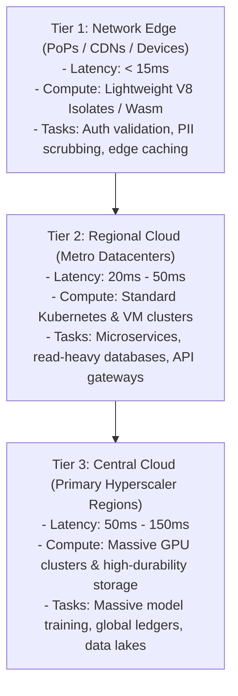

# Cloud vs. Regional vs. Edge Placement Architecture

## 1. The Three-Tier Compute Continuum

```mermaid
flowchart TD
    EdgeTier["Tier 1: Network Edge (PoPs / CDNs / Devices)\n- Latency: < 15ms\n- Compute: Lightweight V8 Isolates / Wasm\n- Tasks: Auth validation, PII scrubbing, edge caching"]
    
    RegionalTier["Tier 2: Regional Cloud (Metro Datacenters)\n- Latency: 20ms - 50ms\n- Compute: Standard Kubernetes & VM clusters\n- Tasks: Microservices, read-heavy databases, API gateways"]
    
    CentralTier["Tier 3: Central Cloud (Primary Hyperscaler Regions)\n- Latency: 50ms - 150ms\n- Compute: Massive GPU clusters & high-durability storage\n- Tasks: Massive model training, global ledgers, data lakes"]

    EdgeTier --> RegionalTier --> CentralTier
```
