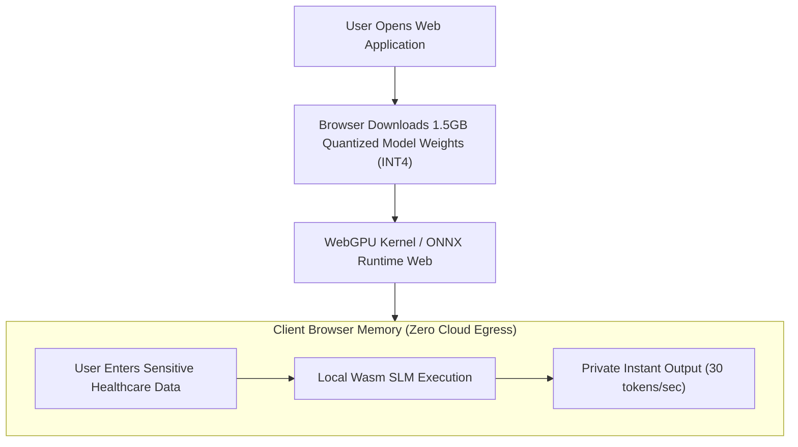

# Edge AI Inference & WebAssembly (Wasm)

## 1. Shifting AI from Cloud to Client Edge

Executing foundation model inference in the cloud incurs severe token API bills and data privacy liabilities. Emerging edge architectures compile Small Language Models (SLMs: 1B–3B parameters) into **WebAssembly (Wasm)** or **WebGPU**, executing inference directly on client devices (laptops, smartphones):

---

## 2. Invariant: Absolute Data Privacy
Because model weights execute entirely inside client device memory, sensitive personal records **never leave the user's physical machine**, completely satisfying extreme GDPR and HIPAA data residency constraints.
