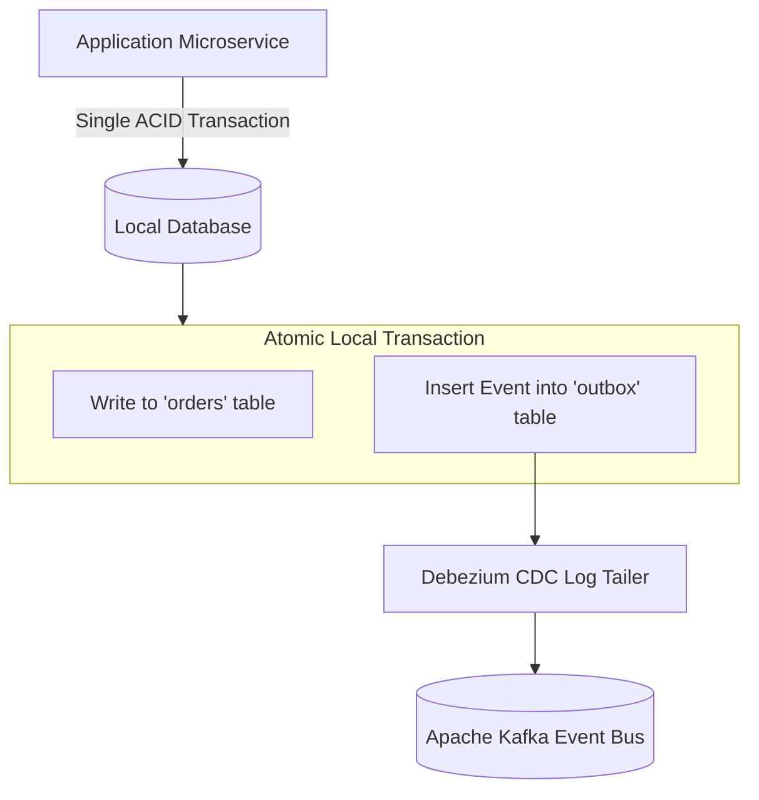

# CDC & Transactional Outbox Modernization Patterns

## 1. The Transactional Outbox Pattern

When an application must mutate a local database AND publish an event to Kafka, writing to both independently causes dual-write inconsistencies if the network fails midway.

The **Transactional Outbox Pattern** ensures that database mutations and event publications are atomic within a single local ACID transaction:

