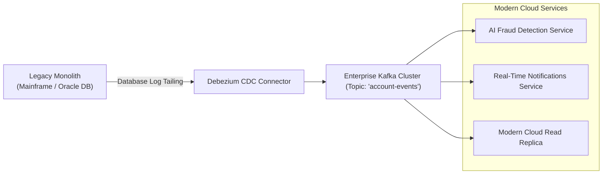

# Event-Driven Legacy Modernization Strategy

## 1. Decoupling the Legacy Core via Events

Direct point-to-point database sharing is a legacy anti-pattern that creates rigid technical debt. Event-driven modernization uses **Change Data Capture (CDC)** to extract state changes from legacy databases as real-time event streams:

