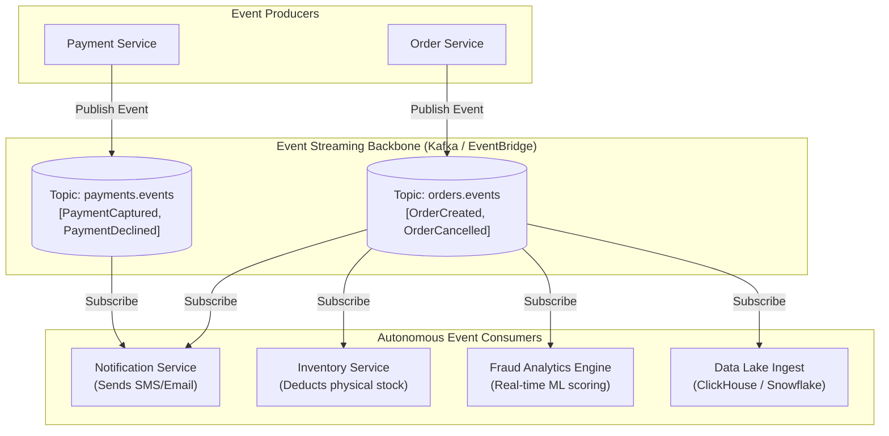
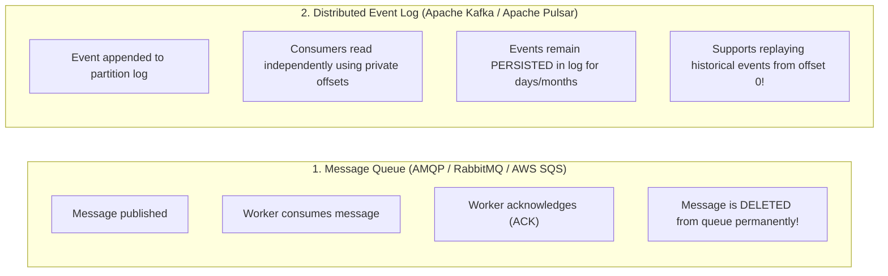
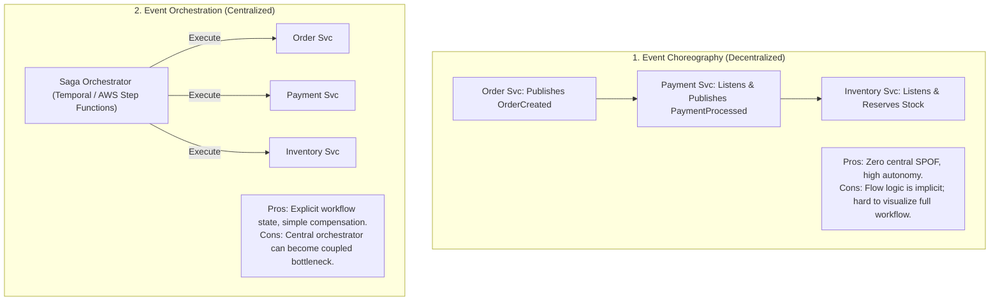
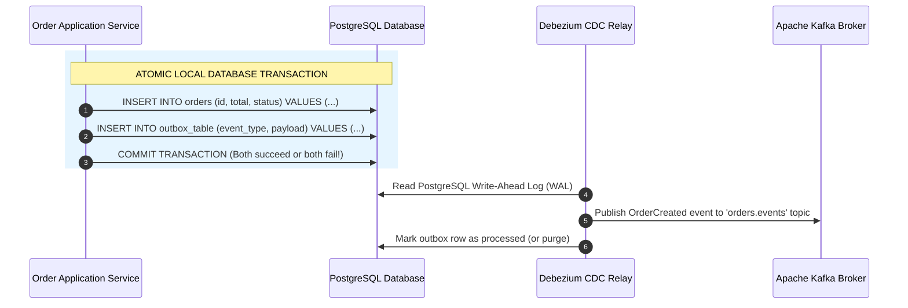

# Event-Driven Architecture (EDA) Pattern

## Overview

Event-Driven Architecture (EDA) is a distributed software architecture paradigm wherein system components communicate primarily by producing, detecting, consuming, and reacting to state changes known as **Events**. An Event represents an immutable, factual occurrence in the past (e.g., `OrderPlaced`, `PaymentFailed`, `InventoryReserved`).

Unlike traditional synchronous request-response architectures (REST/gRPC) where the caller blocks waiting for the callee to execute work, EDA enforces **extreme temporal and spatial decoupling**: event producers publish events without knowing or caring who consumes them, how many consumers exist, or when they will process the message.

---

## Architectural Topology

---

## Core Concepts: Events vs. Commands vs. Messages

| Primitive | Intent & Semantics | Directionality | Temporal Nature | Example |
|:---|:---|:---|:---|:---|
| **Command** | Directive to perform an action. Can be rejected by receiver. | Targeted to 1 specific handler | Synchronous / Expects immediate feedback | `ProcessPaymentCommand`, `CreateUser` |
| **Event** | Statement of an immutable historical fact. Cannot be rejected or undone. | Broadcast / Multi-consumer | Asynchronous / Past tense | `OrderPlacedEvent`, `SensorReadingRecorded` |
| **Message** | Raw envelope containing either a Command or an Event payload. | Point-to-Point or Pub/Sub | Agnostic | AMQP packet, SQS message |

---

## Event Broker Paradigms: Queue vs. Stream

- **Use Message Queues (RabbitMQ/SQS)**: When individual discrete tasks need to be processed by workers and forgotten (e.g., "resize image", "send password reset email").
- **Use Event Streams (Kafka/Pulsar)**: When events represent an immutable audit trail, require multi-subscriber fanout, require temporal replayability, or power streaming analytics (e.g., financial ledger transactions, e-commerce order streams).

---

## Coordination Models: Choreography vs. Orchestration

---

## The Transactional Outbox Pattern

A fatal failure in EDA occurs when a service saves state to its database, but crashes before publishing the event to Kafka ("Dual-Write Failure"). Architects eliminate this with the **Transactional Outbox Pattern**:

---

## Production Realities & Trade-Offs

- **Eventual Consistency**: Consumers process events asynchronously. A customer may submit an order and refresh their page before the inventory consumer has updated the UI. Systems must be designed with optimistic client UIs and asynchronous polling.
- **Idempotent Consumers**: Networks duplicate messages. Every event handler must check an `idempotency_key` or message UUID before executing side effects to prevent charging customers twice.
- **Schema Evolution**: Schemas change over time. Enforce strict backwards and forwards compatibility using an Avro/Protobuf **Schema Registry**.
