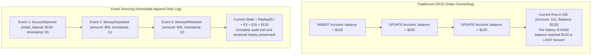
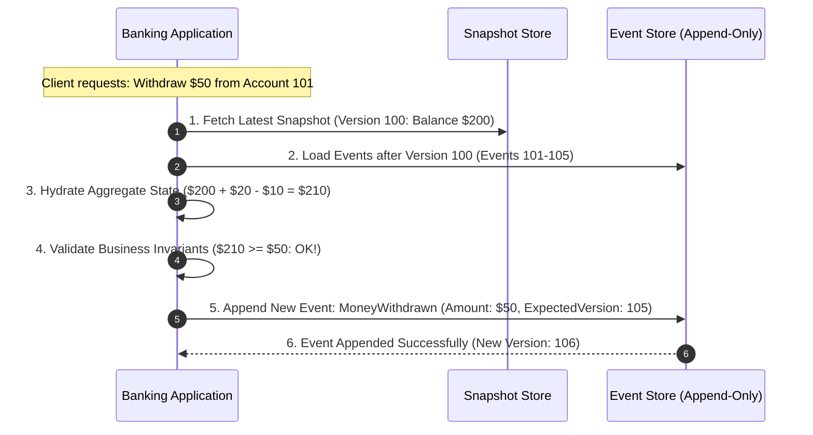

# Event Sourcing Pattern

## Overview

Event Sourcing is an architectural pattern in which the state of an application or domain entity is not persisted as a mutable record (e.g., updating a row in an SQL table with current balances), but rather as an **append-only, immutable sequence of business events**. Every state change in the system is captured as an event and appended to an **Event Store**. 

To determine the current state of an entity at any point in time, the system **replays** all historical events associated with that entity from inception to the present.

---

## Traditional CRUD vs. Event Sourcing

---

## Architectural Topology: Event Store & Snapshotting

---

## Core Capabilities of Event Sourcing

1. **Complete, Verifiable Audit Trail**: Because the Event Store is strictly append-only, no human or system error can overwrite or erase past transactions. This is the foundational model for accounting ledgers and financial systems.
2. **Temporal Querying & Time Travel**: An architect can recreate the exact state of the entire system at any given second in history (e.g., "What was Customer 42's portfolio balance at 11:15:32 AM on October 14th?").
3. **What-If Analysis & Retrospective Modeling**: New business models or fraud detection algorithms can be tested by replaying 5 years of historical events through a newly coded projection engine to observe how it would have behaved.

---

## Performance Optimization: Snapshotting

Replaying 100,000 historical events to hydrate a long-lived aggregate (e.g., an active bank account open for 10 years) introduces unacceptable latency:
- **Snapshots**: Every $N$ events (e.g., every 100 events), the system serializes the aggregate's current state into a Snapshot table.
- **Hydration**: The aggregate loads the latest snapshot ($N=100$) and replays only the events that occurred after the snapshot ($N=101, 102 \dots$).

---

## Pairing Event Sourcing with CQRS

Event Sourcing is almost universally paired with **CQRS**:
- **Write Side**: The Event Store acts as the single source of truth, accepting append-only events.
- **Read Side**: Background projection services subscribe to the Event Store log and materialize read-optimized projections in Elasticsearch, PostgreSQL, or Redis.

---

## Operational Realities & Complexities

| Operational Challenge | Root Cause | Production Mitigation Strategy |
|:---|:---|:---|
| **Schema Evolution** | Event schemas change over 5 years (fields added, renamed, or deprecated) | Implement **Upcasting** in the event deserializer: an upcaster transforms legacy v1 event schemas into modern v3 schemas in memory without modifying the immutable disk log. |
| **GDPR "Right to be Forgotten"** | GDPR mandates erasing customer PII, but event logs are strictly immutable | **Crypto-Shredding**: Encrypt each user's PII within event payloads using an individual, user-specific encryption key in a key vault. To delete the user, destroy the key; the events remain structurally intact but mathematically unreadable. |
| **Optimistic Concurrency** | Two concurrent users attempt to mutate the same aggregate simultaneously | Append operations specify `expected_version`. If a concurrent write incremented the version first, the second write fails with a concurrency exception and retries. |
