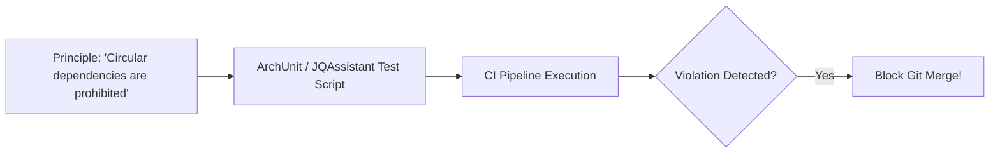

# Architectural Fitness Functions

## 1. Automating Architecture Governance

Architecture principles written in static Word documents or wikis are ignored. **Architectural Fitness Functions** translate principles into automated, executable tests embedded within continuous integration pipelines:

