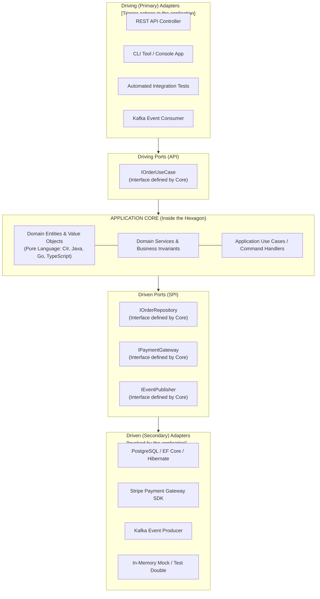
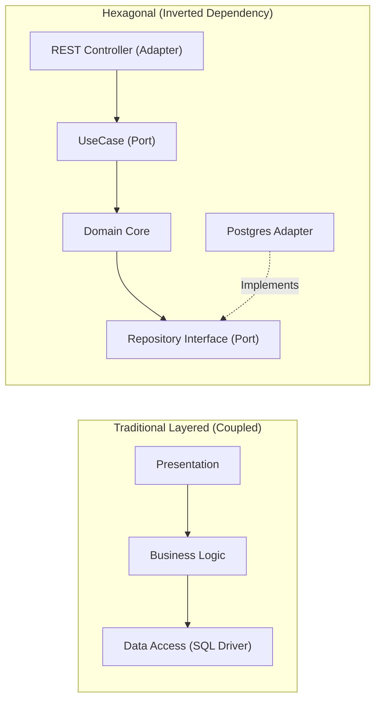

# Hexagonal Architecture Pattern (Ports and Adapters)

## Overview

Hexagonal Architecture—formally termed the **Ports and Adapters Pattern** by Alistair Cockburn in 2005—is an architectural style that strictly isolates an application's core business logic from external technologies, frameworks, user interfaces, and infrastructure dependencies. 

The central principle of Hexagonal Architecture is that **the application core should be equally drivable by a web browser, a command-line interface (CLI), an automated test harness, or a batch script**, and should be completely decoupled from whether data is persisted in PostgreSQL, MongoDB, flat files, or an in-memory test double.

---

## Architectural Topology



---

## The Two Halves: Driving vs. Driven

### 1. Driving (Primary) Side: "Actors that drive the application"
- **Driving Ports**: Public application interfaces (Use Cases) that expose business actions to the outside world (e.g., `PlaceOrder(PlaceOrderCommand command)`).
- **Driving Adapters**: Technology-specific adapters that receive external inputs (HTTP requests, CLI arguments, gRPC calls), translate them into domain commands, and invoke the driving port.

### 2. Driven (Secondary) Side: "Infrastructure driven by the application"
- **Driven Ports**: Abstract interfaces defined by the core application that specify infrastructure services required by business logic (e.g., `IOrderRepository`, `INotificationSender`).
- **Driven Adapters**: Concrete implementations that interact with real external infrastructure (e.g., an SQL repository class querying PostgreSQL, or an SMTP class sending emails).

---

## The Dependency Inversion Principle (DIP)

In traditional layered architectures, the Business Layer depends directly on the Data Access Layer (compile-time dependency points downward). In Hexagonal Architecture, **the dependency points inward toward the domain**:



Because the domain core defines the `IOrderRepository` interface and the PostgreSQL adapter *implements* it, the infrastructure depends on the domain—**the domain core never has a compile-time dependency on any external database, ORM, or cloud SDK**.

---

## Code Example: Pure Domain with Ports and Adapters (.NET / C#)

### The Port (Defined inside Core Domain)
```csharp
namespace Enterprise.Core.Ports;

public interface IOrderRepository
{
    Task<Order?> GetByIdAsync(OrderId id, CancellationToken ct = default);
    Task SaveAsync(Order order, CancellationToken ct = default);
}
```

### The Core Use Case (Inside Hexagon - Zero Infrastructure References)
```csharp
namespace Enterprise.Core.UseCases;

public class PlaceOrderUseCase(IOrderRepository orderRepo, IPaymentGateway paymentGateway)
{
    public async Task<OrderId> ExecuteAsync(PlaceOrderCommand command)
    {
        var order = Order.Create(command.CustomerId, command.Items);
        
        await paymentGateway.AuthorizeAsync(order.TotalAmount);
        await orderRepo.SaveAsync(order);
        
        return order.Id;
    }
}
```

### The Driven Adapter (Outside Hexagon - Infrastructure)
```csharp
namespace Enterprise.Infrastructure.Adapters;

public class PostgresOrderRepository(AppDbContext dbContext) : IOrderRepository
{
    public async Task SaveAsync(Order order, CancellationToken ct = default)
    {
        await dbContext.Orders.AddAsync(order, ct);
        await dbContext.SaveChangesAsync(ct);
    }
    // ...
}
```

---

## Why Enterprise Architects Mandate Hexagonal Architecture

1. **Extreme Testability**: The entire business core can be tested in milliseconds using in-memory mock adapters without spinning up databases, Docker containers, or web servers.
2. **Technological Longevity & Interchangeability**: Replacing PostgreSQL with DynamoDB or upgrading from REST to gRPC requires modifying **only the external adapters**. The core business domain code remains 100% untouched.
3. **Protection against Framework Churn**: Prevents web frameworks (Spring Boot, ASP.NET Core, Express) from leaking annotations and dependencies into core business entities.
