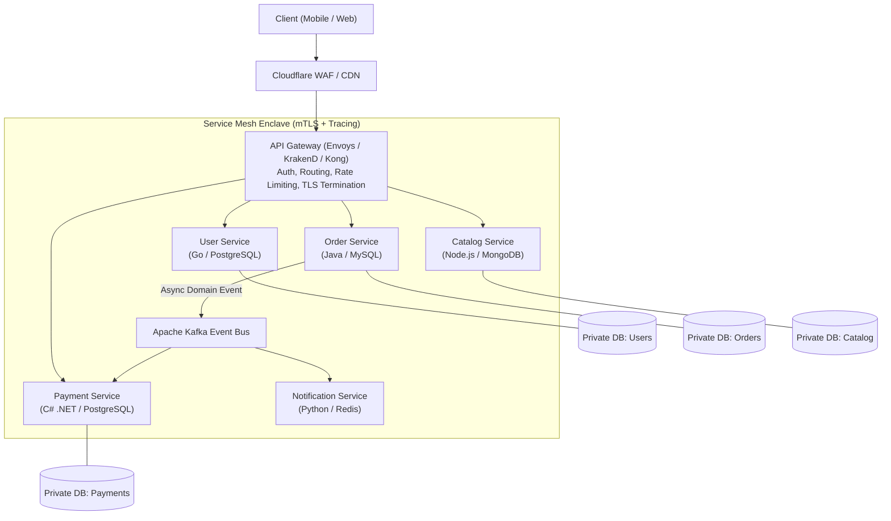

# Microservices Architecture Pattern

## Overview

The Microservices Architecture Pattern structures an enterprise application as a suite of small, autonomous, loosely coupled services modeled around discrete business domains (Bounded Contexts). Each microservice is independently deployable, independently scalable, maintains its own private data store (Decentralized Data Management), and communicates with other services via well-defined, standardized network protocols (REST, gRPC, or asynchronous message streams).

---

## Architectural Topology

---

## Core Characteristics & Tenets

1. **Decentralized Data Ownership (Database-per-Service)**: Services must never share a database directly. If Service A needs data owned by Service B, it must request it via Service B's public API or subscribe to Service B's published domain events.
2. **Independent Deployability**: A bug fix or feature addition in the Order Service must deploy to production without building, testing, or restarting any other service in the ecosystem.
3. **Conway's Law Alignment**: Service boundaries mirror autonomous cross-functional product teams (typically "Two-Pizza Teams" of 6–8 engineers) owning end-to-end delivery from requirements to operations.
4. **Polyglot Architecture**: Freedom to select the optimal language, framework, and database for the specific workload (e.g., Python for ML scoring, Go for high-throughput I/O proxying).

---

## When to Use Microservices

- **Large Engineering Organizations**: When 50+ engineers are contributing to a codebase and release collisions/merge conflicts in a monolith impede business delivery.
- **Disparate Scaling & Resource Profiles**: When one subsystem (e.g., video transcoding or real-time geolocation tracking) requires 100x more compute/memory scale than the rest of the application.
- **Strict Fault Isolation Requirements**: When an outage in a non-essential service (e.g., customer reviews) must never bring down the primary transaction flow (checkout).

## When NOT to Use Microservices (Anti-Patterns)

- **Early-Stage Startups & Unknown Domains**: When business requirements and domain boundaries are rapidly shifting. Carving microservices around incorrect boundaries creates the dreaded "Distributed Monolith".
- **Small Teams (< 15 Engineers)**: When the team lacks dedicated platform engineering (SRE, Kubernetes, DevSecOps) to manage distributed tracing, service meshes, and deployment pipelines.

---

## Key Challenges & Mitigations

| Challenge | Architectural Impact | Production Mitigation Pattern |
|:---|:---|:---|
| **Distributed Transactions** | Cannot use ACID database locks across independent service databases | Implement the **Saga Pattern** (Orchestrated or Choreographed) with compensating transactions. |
| **Data Aggregation & Reporting** | Generating a single screen requires joining data across 6 different microservices | Implement **CQRS (Command Query Responsibility Segregation)** with read-optimized materialized views. |
| **Cascading Network Failures** | Slow downstream dependency exhausts thread pools in caller services | Deploy **Circuit Breakers (Resilience4j / Polly)**, aggressive timeouts, and bulkheads. |
| **Distributed Debugging** | Tracing a request across 10 network hops without context is impossible | Implement **OpenTelemetry (OTel)** with W3C TraceContext header propagation across all HTTP and Kafka boundaries. |
