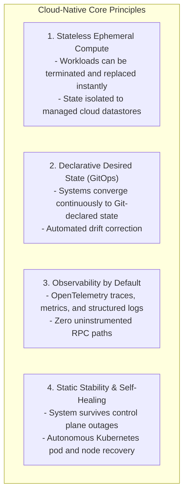

# Modern Cloud-Native Architecture Principles

## 1. The Cloud-Native Paradigm

Cloud-native architecture is not merely running virtual machines in someone else's datacenter. It is an architectural methodology engineered for **continuous change, horizontal elasticity, self-healing autonomy, and platform decoupling**.

