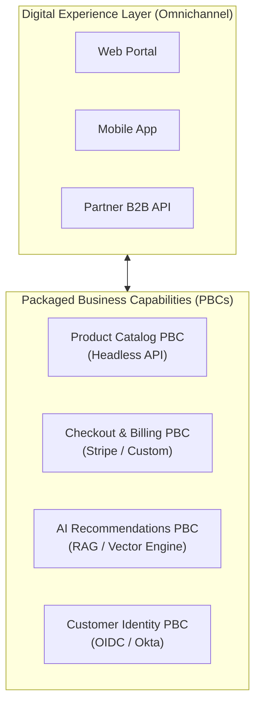

# Composable & Modular Enterprise Architecture

## 1. The Composable Enterprise

A **Composable Enterprise** organizes business capabilities into autonomous, reusable software building blocks called **Packaged Business Capabilities (PBCs)**:

---

## 2. Invariant: Contract Independence
Each PBC encapsulates its own internal datastore, business logic, and release lifecycle. External consumers interact exclusively through versioned APIs or event streams.
