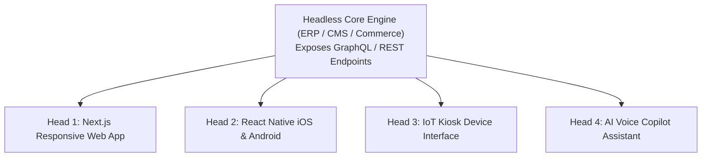

# Headless & API-First Enterprise Systems

## 1. Decoupling the Presentation Tier

Traditional monolithic enterprise suites tightly bind the database, business logic, and presentation UI into a single codebase. **Headless Architecture** strips away the frontend presentation layer entirely, exposing all business capabilities strictly as **APIs-as-a-Product**.

