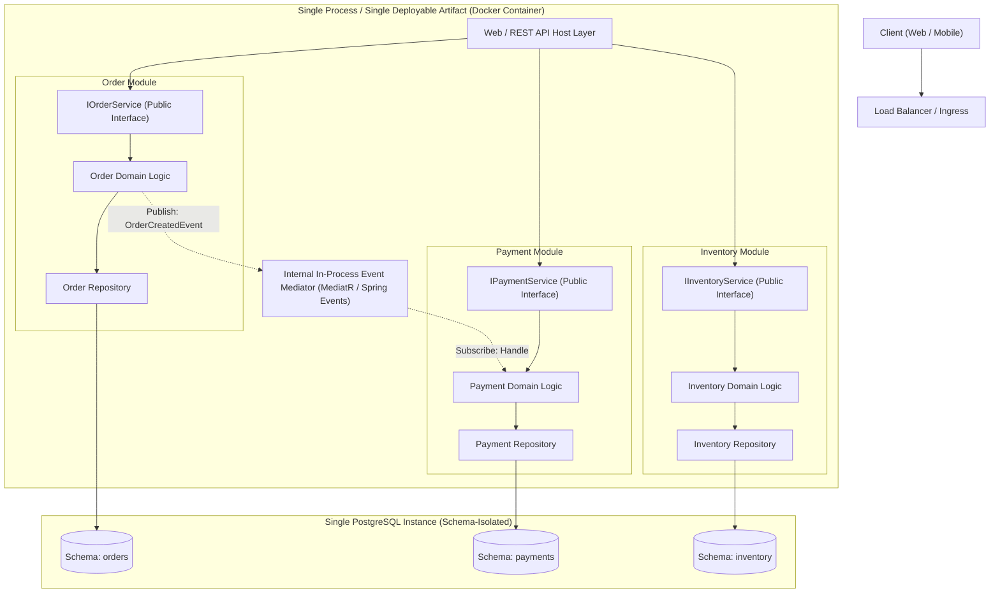

# Modular Monolith Architecture Pattern

## Overview

A Modular Monolith is an architectural pattern where an entire system is built and deployed as a single runtime artifact (e.g., a single Docker container or executable), but internally structured into strictly isolated, loosely coupled domain modules. Each module encapsulates its own business logic, domain entities, and data access, communicating with other modules exclusively through explicit public interfaces or internal in-memory event dispatchers.

The Modular Monolith combines the **architectural cleanliness and boundary discipline of microservices** with the **operational simplicity, transactional ACID consistency, and sub-millisecond execution of a monolith**.

---

## Architectural Topology



---

## The Core Tenets of Modular Monoliths

1. **Strict Module Boundary Isolation**: Module internals (internal classes, repositories, database entities) must be inaccessible to other modules (`internal` access modifiers in C#, package-private in Java, or compiler-enforced path boundaries in Go/TypeScript).
2. **Communication Exclusively via Contracts**: A module may interact with another module only via:
   - Synchronous invocation of a strongly typed public interface (e.g., `IOrderService`).
   - Asynchronous in-memory event dispatching (e.g., publishing `OrderPlacedDomainEvent` through an internal mediator like MediatR).
3. **Database Schema Isolation**: Even though all modules share the same physical database server, each module must own its own isolated schema (e.g., `orders.table` vs. `payments.table`). Direct SQL joins across module schemas are strictly forbidden!

---

## Enforcing Architecture Boundaries via Automated Fitness Functions

To prevent a Modular Monolith from decaying into a "Big Ball of Mud", architects use automated architectural testing tools (NetArchTest in .NET, ArchUnit in Java) in continuous integration:

```csharp
// Example NetArchTest rule enforcing module isolation
[Fact]
public void OrderModule_ShouldNotReference_PaymentModuleInternals()
{
    var result = Types.InAssembly(typeof(OrderModule).Assembly)
        .That().ResideInNamespace("Enterprise.Modules.Order")
        .ShouldNot().HaveDependencyOn("Enterprise.Modules.Payment.Internal")
        .GetResult();

    Assert.True(result.IsSuccessful, "Order module directly bypassed Payment public interface!");
}
```

---

## When to Choose a Modular Monolith

- **Default Choice for Greenfield Systems**: Highly recommended default for 90% of enterprise systems. Allows discovering true business domain boundaries without distributed network penalties.
- **Teams with Constrained DevOps / SRE**: Maximizes feature velocity when teams cannot justify dedicated Kubernetes operators, service meshes, or distributed tracing platforms.
- **Workloads Requiring Strong ACID Consistency**: Guarantees atomic cross-module transactions within the same database engine when absolutely necessary.

---

## Evolutionary Path: Extracting a Microservice

A well-architected Modular Monolith provides the perfect launchpad for microservices. If the `Payment` module eventually requires independent scaling or a dedicated external PCI-DSS compliance enclave:
1. Swap the internal in-process interface `IPaymentService` with an HTTP/gRPC client implementation.
2. Move the `payments` database schema to an independent PostgreSQL instance.
3. Extract the `Payment` module code into its own repository and deploy as an independent container.
4. The remaining modules require **zero internal code changes** because they interacted only through the interface.
