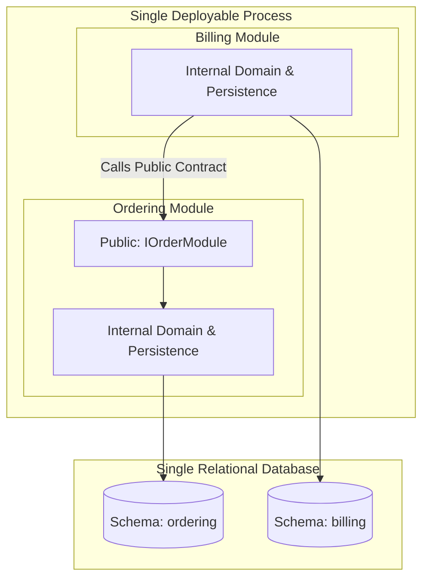

# Modular Monolith: Deployment Model & Operational Overhead

## 1. Problem & Architectural Context
Contrasting the simplicity of deploying one container artifact with the operational burden of managing 40 independent Kubernetes deployments.

---

## 2. Structural Architecture & Communication Flow



---

## 3. Implementation Rules & Best Practices
- **Strict Database Schema Separation**: Even if sharing a physical database, Module A cannot run queries that join across Module B's schema tables.
- **Contract-Based Interfaces**: Modules interact exclusively through strongly typed contract interfaces and immutable DTOs.
- **Asynchronous In-Memory Events**: Prefer emitting internal events over synchronous cross-module orchestration to preserve autonomy.

---

## 4. Architectural Trade-Off Analysis

```
+--------------------------+---------------------------------+---------------------------------+
| Architectural Dimension  | Strengths                       | Trade-Offs / Risks              |
+--------------------------+---------------------------------+---------------------------------+
| Deployment Complexity    | Minimal (1 artifact, 1 pipeline)| Unified deployment blast radius |
| Latency & Performance    | Ultra-fast in-memory calls (0ms)| Single technology runtime       |
| Refactoring Agility      | Safe compile-time refactoring   | Requires discipline to avoid bypass|
| Developer Velocity       | Instant local debug & testing   | Scale bounded by largest host   |
+--------------------------+---------------------------------+---------------------------------+
```

---

## 5. When to Use vs When NOT to Use
- **Use When**: Building a new platform from scratch, small-to-medium teams (< 50 engineers), or systems requiring high transactional integrity.
- **Do NOT Use When**: Teams are completely independent with distinct geopolitical deployment boundaries, or individual components require radically different hardware (e.g., GPU vs CPU).
