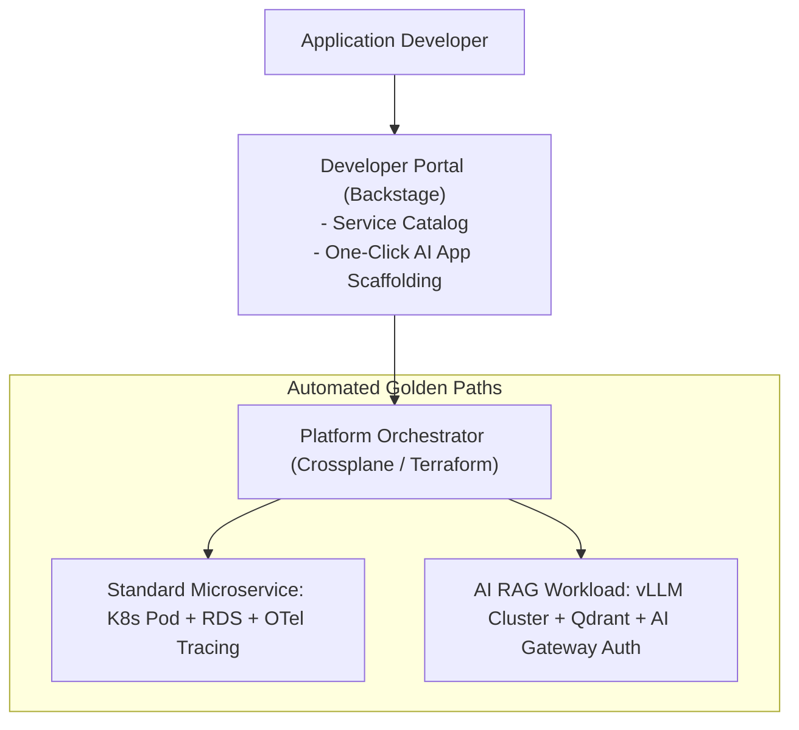

# Internal Developer Platforms for Cloud & AI

## 1. The Internal Developer Platform (IDP) Blueprint

```mermaid
flowchart TD
    Dev["Application Developer"] --> Portal["Developer Portal (Backstage)\n- Service Catalog\n- One-Click AI App Scaffolding"]
    
    Portal --> Orchestrator["Platform Orchestrator (Crossplane / Terraform)"]
    
    subgraph GoldenPaths ["Automated Golden Paths"]
        Orchestrator --> P1["Standard Microservice: K8s Pod + RDS + OTel Tracing"]
        Orchestrator --> P2["AI RAG Workload: vLLM Cluster + Qdrant + AI Gateway Auth"]
    end
```
