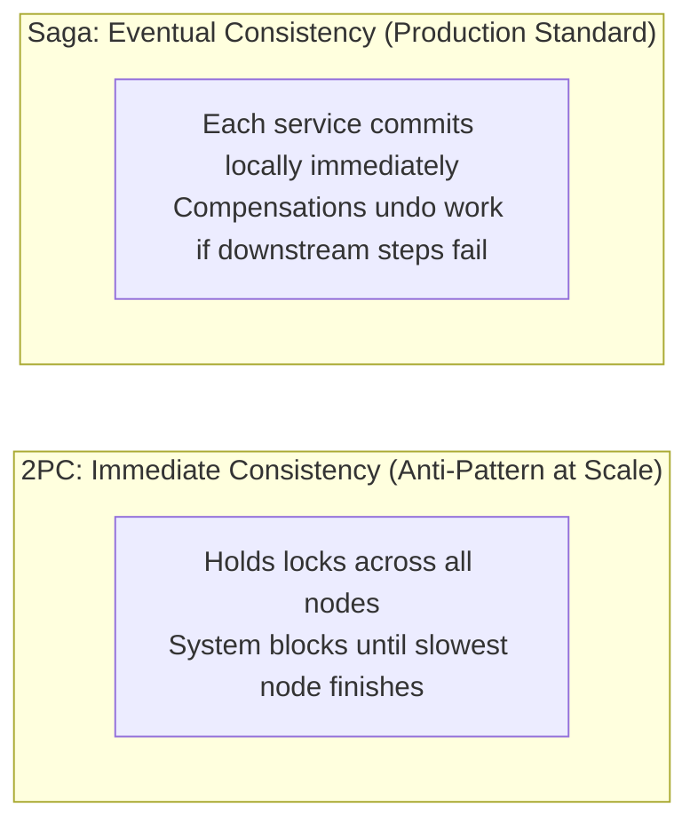
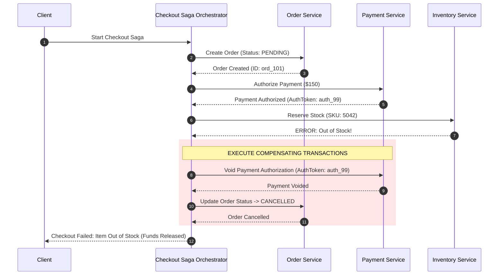

# Saga Architecture Pattern

## Overview

The Saga Pattern is a design pattern for managing distributed transactions across multiple independent microservices and databases without relying on traditional distributed two-phase commit (2PC) locks. A Saga is a sequence of local transactions where each local transaction updates data within a single service and publishes an event or message to trigger the next local transaction in the Saga.

If any local step fails (e.g., credit card declined or item out of stock), the Saga executes a series of **Compensating Transactions** that undo the changes made by the preceding successful steps in reverse order, restoring business data consistency.

---

## Why Two-Phase Commit (2PC) Fails at Enterprise Scale

Traditional distributed transactions rely on the XA standard and Two-Phase Commit (2PC):
- **Synchronous Locking**: 2PC holds physical database locks on rows across all participating services for the entire duration of the transaction.
- **Latency & Availability Collapse**: If any single network node or database hesitates or crashes, all locks remain held indefinitely, causing database thread exhaustion and global system paralysis.
- **Microservices Incompatibility**: Modern cloud databases (DynamoDB, Cassandra, MongoDB) do not support XA/2PC across different engines.



---

## The Anatomy of a Saga: Transaction Types

A Saga categorizes its sequential steps into three distinct transaction types:

1. **Compensable Transactions**: Steps that can potentially be rolled back or undone by executing a compensating transaction (e.g., reserving an airline seat, reserving credit).
2. **Pivot Transaction**: The point of no return in the Saga. If the pivot transaction succeeds, the Saga will run to completion. If it fails, the Saga must abort and execute compensations.
3. **Retriable Transactions**: Steps following the pivot transaction that are guaranteed to succeed eventually via idempotent retries (e.g., sending an order confirmation email, updating customer loyalty points).

---

## Saga Implementation Models: Choreography vs. Orchestration

```mermaid
flowchart TD
    subgraph Choreography["1. Choreographed Saga (Decentralized Events)"]
        C1["Order Svc: OrderCreated"] --> C2["Payment Svc: PaymentReserved"]
        C2 --> C3["Inventory Svc: OutOfStock!"]
        C3 -.->|Compensate: ReleasePayment| C2
        C3 -.->|Compensate: CancelOrder| C1
    end

    subgraph Orchestration["2. Orchestrated Saga (Centralized State Machine)"]
        O_Mgr["Saga Orchestrator<br/>(Workflow Engine / State Machine)"]
        O_Mgr -->|1. Create Order| O_Order["Order Svc"]
        O_Mgr -->|2. Authorize Charge| O_Pay["Payment Svc"]
        O_Mgr -->|3. Deduct Stock (FAILS)| O_Inv["Inventory Svc"]
        O_Mgr -.->|Compensate: Refund Charge| O_Pay
        O_Mgr -.->|Compensate: Mark Cancelled| O_Order
    end
```

### Choreography vs. Orchestration Comparison

| Feature | Choreographed Saga | Orchestrated Saga |
|:---|:---|:---|
| **Coordination** | Decentralized via Kafka/RabbitMQ events | Centralized orchestrator (Temporal, Camunda, AWS Step Functions) |
| **Coupling** | Loosely coupled; services only know about incoming events | Orchestrator knows about all participating service APIs |
| **Complexity** | Simple for 2–3 steps; becomes an unmaintainable "spaghetti" for 5+ steps | Explicit, visual, centralized state machine; easy to reason about |
| **Failure Visibility** | Difficult to track where a stuck transaction currently resides | Real-time observability dashboard showing exact state of every running Saga |
| **Recommendation** | Use only for simple 2-step workflows | **Mandatory production standard for complex multi-step enterprise flows** |

---

## Handling the Lack of ACID Isolation (ACD without I)

Sagas guarantee **Atomicity**, **Consistency**, and **Durability**, but **lack Isolation**. Because each local transaction commits immediately, other concurrent users can view dirty, uncommitted intermediate states.

### Architectural Strategies to Prevent Concurrency Anomalies
1. **Semantic Locking (Pending States)**: Never mark a resource as `Purchased` in step 1. Mark it as `Status = PENDING_PAYMENT`. Concurrent transactions recognize this status and know not to modify the record until the Saga completes.
2. **Commutative Updates**: Design operations so that they can be applied in any order without corrupting state (e.g., adding to a balance instead of setting an absolute balance).
3. **Pessimistic Read Locks**: Block critical read operations on an aggregate while its state is in a `PENDING` Saga status.

---

## Worked Example: E-Commerce Checkout Saga Orchestration


