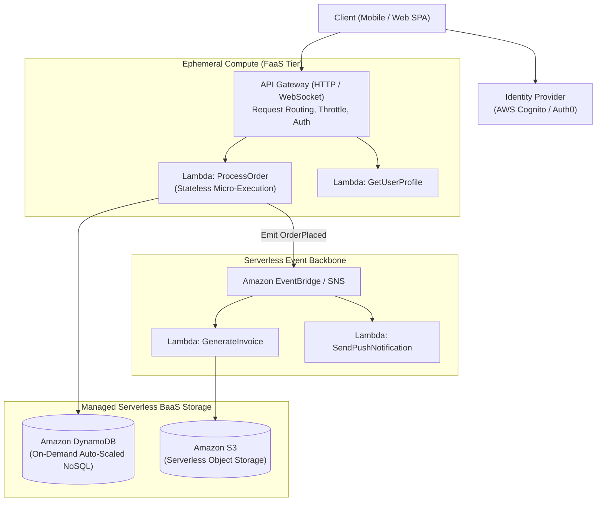
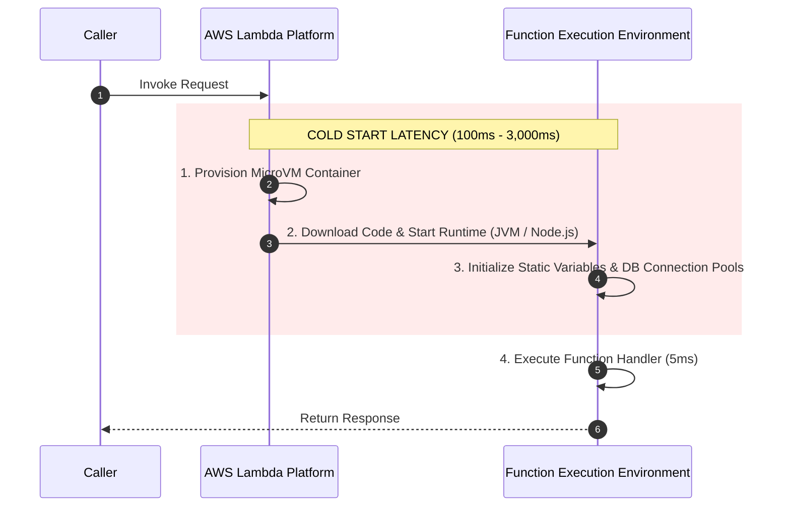

# Serverless Architecture Pattern

## Overview

Serverless Architecture is a cloud-native software design paradigm where developers build and run applications and services without managing, provisioning, patching, or scaling physical or virtual servers. The execution of application code is handled entirely by a cloud provider using **Function-as-a-Service (FaaS)** (e.g., AWS Lambda, Azure Functions, Google Cloud Functions), seamlessly orchestrated with fully managed **Backend-as-a-Service (BaaS)** components (e.g., DynamoDB, S3, Cognito, EventBridge).

The fundamental business promise of Serverless is **Zero Idle Cost** (pay strictly for execution milliseconds) and **Automatic, Autonomous Elasticity** (scaling from zero to tens of thousands of concurrent executions instantaneously).

---

## Architectural Topology



---

## Core Characteristics of Serverless Systems

1. **Zero Server Management**: No operating system patching, no SSH access, no AMI provisioning, and no container orchestrator cluster maintenance.
2. **True Pay-for-Use Pricing**: Billing is calculated strictly in fractional-second increments ($1\text{ms}$ or $100\text{ms}$) while the code is actively executing. When no requests arrive, **cost is literally $0.00**.
3. **Stateless Ephemeral Execution**: Execution containers are created dynamically on demand and destroyed after idle timeouts. In-memory state does not persist between invocations.
4. **Event-Driven Invocation**: Functions do not run continuously in background loops. They execute only in response to discrete triggers: HTTP requests, S3 file uploads, DynamoDB streams, Kafka messages, or cron schedules.

---

## The Cold Start Challenge & Mitigation Strategies

When a serverless function is invoked after being idle, or when scaling out to handle new concurrent requests, the cloud provider must allocate a microVM (Firecracker), initialize the runtime (JVM/.NET CLR/Node.js), load application code, and run static constructors. This delay is known as a **Cold Start**:



### Production Cold Start Mitigations
1. **Runtime Selection**: Compiled native languages (Go, Rust) and lightweight runtimes (Node.js, Python) exhibit cold starts of **$< 50\text{ms}$**. Heavy runtimes (traditional Java Spring Boot) suffer cold starts of **$2\text{ to }5\text{ seconds}$**.
2. **Ahead-of-Time (AOT) Compilation**: For Java and .NET workloads, compile using **GraalVM Native Image** or **.NET Native AOT**, slashing cold starts from 3 seconds to under 150ms.
3. **Provisioned Concurrency**: Pay a small baseline fee to keep a pre-warmed pool of execution environments continuously initialized, reducing cold starts to zero for latency-critical paths.

---

## Serverless Cost Curves: When Serverless Becomes Expensive

Serverless is not always cheaper than provisioned infrastructure:

```mermaid
graph LR
    subgraph CostTension["Serverless vs. Provisioned Cost Inflection"]
        A["Low / Bursty Traffic: Serverless is 90% CHEAPER (Zero idle spend)"]
        B["High Sustained 24/7 Traffic: Provisioned Containers (ECS/EKS) are 60-80% CHEAPER!"]
        A -->|Traffic crosses inflection point (e.g. 5,000 continuous RPS)| B
    end
```

- **Ideal Workloads**: Webhook ingestion, asynchronous batch file processors, marketing campaign endpoints, cron schedules, internal corporate tools with overnight zero-traffic.
- **Anti-Pattern Workloads**: Ultra-high-throughput, 24/7 steady-state transaction streams (e.g., 20,000 RPS continuous ad-bidding or telemetry ingestion). At steady high volume, Lambda millisecond pricing far exceeds the cost of a dedicated Kubernetes cluster.

---

## Architectural Realities & Best Practices

- **Relational Database Connection Exhaustion**: Traditional databases (PostgreSQL/MySQL) cannot handle 5,000 Lambda functions concurrently opening TCP connections. **Mandatory**: Insert a connection pooler like **AWS RDS Proxy** or adopt connectionless HTTP-native databases (DynamoDB, PlanetScale, Neon).
- **Execution Time Limits**: Cloud providers enforce maximum timeout limits (e.g., 15 minutes in AWS Lambda). Never attempt to run long-running batch migrations or daemon processes inside a serverless function; use AWS ECS Fargate or Batch instead.
