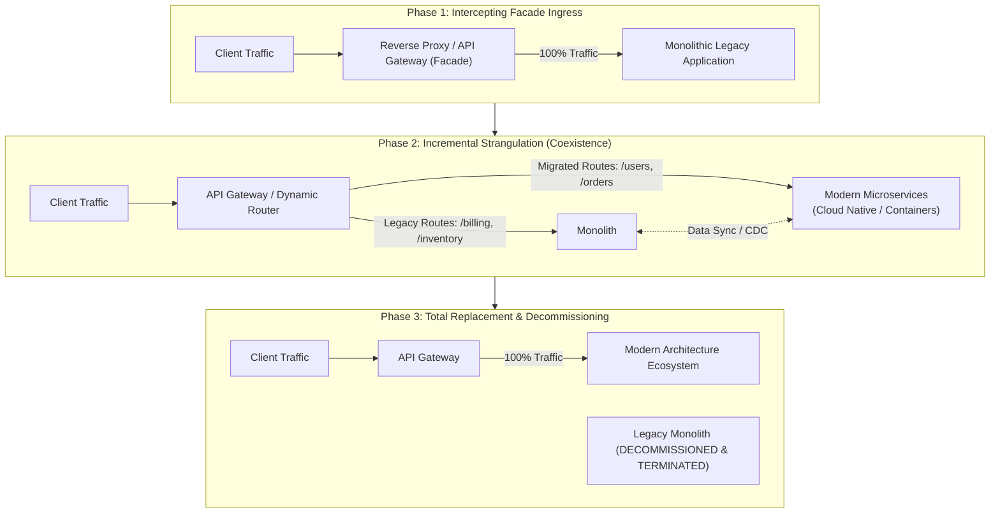
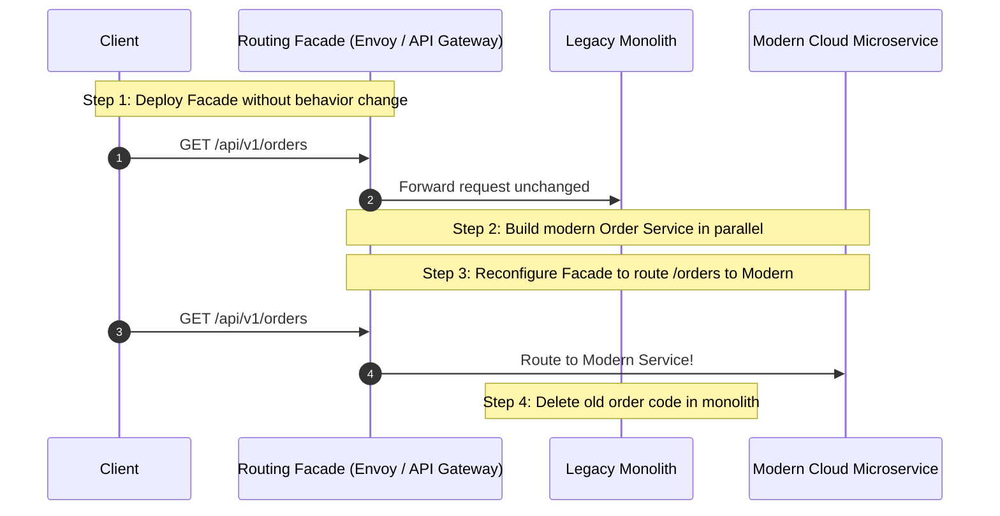
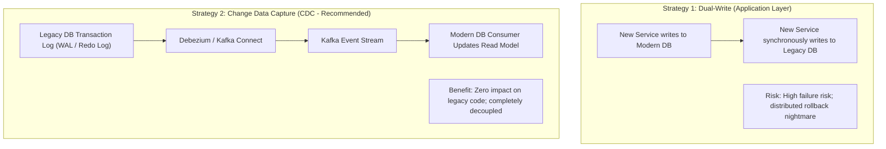
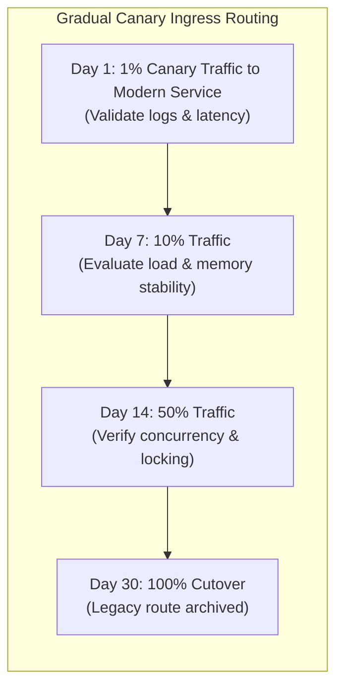

# Strangler Fig Architecture Pattern

## Overview

The Strangler Fig Pattern (originally named the *Strangler Application* pattern by Martin Fowler in 2004, inspired by Australian strangler fig vines that grow around host trees until the host tree dies and rots away) is an architectural migration strategy for incrementally modernizing, replacing, or refactoring legacy monolithic applications. 

Rather than attempting a catastrophic "Big Bang Rewrite" (which historically fails or runs years over budget in 80%+ of enterprise initiatives), the Strangler Fig pattern gradually replaces legacy functionality by carving out discrete domains into modern microservices or modular components behind an intercepting facade until the legacy system can be safely decommissioned.

---

## Architectural Evolution Topology

---

## The 4 Core Implementation Steps

---

## Data Migration & Synchronization Strategies

Migrating application code is straightforward; migrating legacy databases while keeping systems online 24/7 is the true architectural challenge:

---

## Canary Traffic Shifting & Fallback Mechanics

When strangling a mission-critical domain (e.g., Payment Authorization), never flip 100% of traffic overnight:

### Shadow Traffic (Dark Launching)
Prior to routing live user requests to the modern service, duplicate production traffic at the API Gateway:
1. Send the primary request to the legacy monolith and return its response to the user.
2. Asynchronously "shadow" (fork) a duplicate request to the new modern service.
3. Compare the legacy and modern responses via an automated diff analyzer; identify and fix discrepancies with zero customer impact.

---

## Decommissioning and Cleaning Up

The most commonly neglected phase of the Strangler Fig pattern is **Legacy Decommissioning**:
- Teams successfully strangulate 80% of the monolith, but abandon the project, leaving the organization with two architectures to maintain instead of one.
- **Architectural Discipline**: Every strangulation milestone must include a dedicated sprint to delete dead code from the monolith, drop obsolete database tables, revoke unused IAM roles, and reclaim cloud compute.
