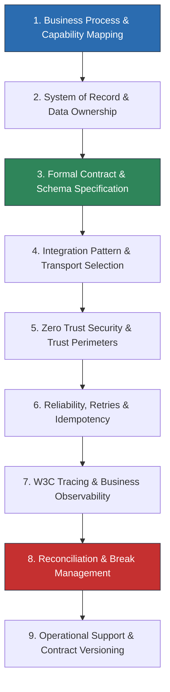

# Enterprise Integration Architecture Library

Welcome to the **Enterprise Integration Architecture Library**. This directory is the production reference for Solution Architects, Technical Architects, and Enterprise Architects designing and governing complex integration programs across heterogeneous enterprise platforms, legacy systems, regulated domains, industry protocols, and vendor software ecosystems.

---

## 1. Domain Ownership: `14-enterprise-integration` vs `07-integration`

To maintain a strict single source of truth across the handbook, integration architecture is divided into two complementary disciplines:

```text
+-------------------------------------------------------------------------+
|                  07-integration/ (Generic Primitives)                   |
|   - HTTP / REST / GraphQL / gRPC Mechanics                              |
|   - Basic Message Brokers (RabbitMQ, Apache Kafka fundamentals)         |
|   - Webhook Delivery Semantics & API Gateway Primitives                 |
|   - Standard Enterprise Integration Patterns (EIP Definitions)          |
+-------------------------------------------------------------------------+
                                    |
                                    v
+-------------------------------------------------------------------------+
|           14-enterprise-integration/ (Enterprise Domain Context)        |
|   - Regulated Industry Protocols (ISO 20022, FHIR R4/R5, HL7 v2, PCI)   |
|   - Core Banking & Instant Payments Clearing / Settlement Topologies    |
|   - Enterprise Systems of Record (SAP S/4HANA ERP, Salesforce CRM)      |
|   - Heavy Legacy Platforms (IBM Mainframe, COBOL, 3270, Batch Windows)  |
|   - Enterprise Reconciliation, Break Management & Financial Parity     |
|   - Multi-System Distributed Transaction Sagas & Compensating Workflows |
|   - Platform Evaluation (API Gateway vs ESB vs Event Mesh vs iPaaS)     |
+-------------------------------------------------------------------------+
```

---

## 2. Enterprise Integration Lifecycle

Every enterprise integration artifact in this library maps directly to the end-to-end integration lifecycle:



---

## 3. Library Directory Index

### Core Domains & Systems
1. **[banking/](banking/README.md)** — Core Banking architecture, BIAN service domain mapping, accounts, ledger integration, open banking (PSD2/CDR), and real-time settlement.
2. **[payments/](payments/README.md)** — Payment processing lifecycle, card networks, ACH, FedNow/SEPA, chargebacks, refunds, and payment events.
   * **[payments/pci-dss/](payments/pci-dss/README.md)** — Cardholder Data Environment (CDE) segmentation, tokenization, trust boundaries, and PCI DSS v4.0 architecture checklists.
3. **[healthcare/](healthcare/README.md)** — EHR/EMR interoperability, Master Patient Index (MPI), clinical data flows, consent management, and HIPAA compliance.
4. **[industry-standards/](industry-standards/README.md)** — Regulated message specifications:
   * **[iso-20022/](industry-standards/iso-20022/README.md)** — Financial messaging (`pacs`, `pain`, `camt`, `remt`), ISO validation, and transformation.
   * **[fhir/](industry-standards/fhir/README.md)** — HL7 FHIR resources, profiles, extensions, REST endpoints, and SMART on FHIR.
   * **[hl7/](industry-standards/hl7/README.md)** — HL7 v2 message parsing, segments, ACK/NAK semantics, and integration engines.
5. **[erp/](erp/README.md)** — Enterprise Resource Planning master data, Order-to-Cash, Procure-to-Pay, and Record-to-Report.
   * **[erp/sap/](erp/sap/README.md)** — SAP S/4HANA integration, OData v4 APIs, IDoc processing, RFC, and SAP Event Mesh.
6. **[crm/](crm/README.md)** — Customer 360, Master Customer Data, and CRM ↔ ERP synchronization.
   * **[crm/salesforce/](crm/salesforce/README.md)** — Salesforce REST/GraphQL, Bulk API v2, Platform Events, CDC, and governor limits.
7. **[legacy/](legacy/README.md)** — IBM Mainframe (z/OS), COBOL copybooks, 3270 terminal emulation, flat files, batch windows, Anti-Corruption Layers (ACL), and Strangler Fig patterns.

### Cross-Cutting Disciplines & Platforms
8. **[integration-platforms/](integration-platforms/README.md)** — Comparative decision matrix: API Gateway vs API Management vs ESB vs Message Broker vs Event Mesh vs iPaaS vs Workflow Engine vs ETL.
9. **[patterns/](patterns/README.md)** — Enterprise extensions of EIP (Content-Based Router, Splitter, Aggregator, Resequencer, Transactional Outbox/Inbox, Saga).
10. **[reconciliation/](reconciliation/README.md)** — Multi-way financial matching, automated break detection, exception handling, and auditing.
11. **[integration-security/](integration-security/README.md)** — Mutual TLS 1.3, OAuth2/OIDC client credentials, PKI certificate governance, and sensitive data protection.
12. **[integration-reliability/](integration-reliability/README.md)** — Timeouts, exponential backoff with full jitter, circuit breakers, idempotency keys, and poison pill isolation.
13. **[integration-observability/](integration-observability/README.md)** — W3C distributed tracing, correlation IDs, business transaction monitoring, and SLA metrics.
14. **[modernization/](modernization/README.md)** — Legacy-to-API, legacy-to-events, coexistence runbooks, dual-write CDC, and rollback procedures.
15. **[testing/](testing/README.md)** — Consumer-driven contract testing (Pact), schema validation, chaos failure injection, and replay testing.

### Reference Architectures, Case Studies & Toolkits
* **[Reference Architectures](reference-architectures/README.md)** — 12 Production reference architectures (Core Banking, Payments, FHIR HIE, SAP S/4HANA, Salesforce, Legacy Mainframe, etc.).
* **[Case Studies](case-studies/README.md)** — 8 Real-world enterprise modernization and integration engineering teardowns.
* **[Architecture Decision Records](adr/)** — 10 Enterprise Integration ADRs following canonical repository standards.
* **[Checklists](checklists/)** — 13 Practical, checkbox-driven audit checklists for ARB and peer reviews.
* **[Decision Frameworks](decision-frameworks/)** — Integration Complexity Calculator and Integration Maturity Model (Levels 1–5).

---

## 4. Foundational Guides (Root)
* **[Enterprise Integration Principles](enterprise-integration-principles.md)** — 24 Core principles governing enterprise integrations.
* **[Integration Selection Guide](integration-selection-guide.md)** — Master decision framework answering the 18 architectural integration questions.
* **[Integration Governance](integration-governance.md)** — Contract ownership, interface lifecycles, and versioning rules.
* **[Canonical Data Models](canonical-data-models.md)** — Point-to-Point vs Canonical models: governance, cost, and complexity.
* **[Batch vs Real-Time Coexistence](batch-vs-real-time.md)** — Architectural patterns for bridging scheduled batch and real-time streams.
* **[Multi-System Distributed Transactions](multi-system-transactions.md)** — Sagas, compensating transactions, and distributed consensus realities.
* **[Integration Anti-Patterns](anti-patterns.md)** — 22 Costly integration traps and proven architectural remedies.

---

## 5. Related Repository Sections
- [06-data/](../06-data/README.md) — Enterprise data platforms, storage engines, and schema management.
- [07-integration/](../07-integration/README.md) — Generic technical integration patterns and network protocols.
- [08-cloud/](../08-cloud/README.md) — Cloud landing zones, hybrid networking, and VPC topologies.
- [10-security/](../10-security/README.md) — Zero Trust, cryptographic standards, and identity architecture.
- [11-observability/](../11-observability/README.md) — Telemetry, OpenTelemetry standards, and distributed tracing.
- [15-modernization/](../15-modernization/README.md) — Legacy modernization frameworks and monolith decomposition.
- [16-architecture-deliverables/](../16-architecture-deliverables/README.md) — Production architecture templates (SAD, HLD, LLD, ADR).
- [17-diagrams/](../17-diagrams/README.md) — Canonical enterprise architecture diagram catalog.
- [23-enterprise-architecture/](../23-enterprise-architecture/README.md) — Enterprise frameworks (TOGAF, BIAN, Zachman).
