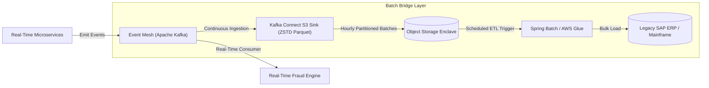

# Batch vs Real-Time Integration Coexistence

## 1. The Architectural Reality
Enterprise organizations rarely operate in a purely real-time world. Legacy ERPs, bank clearing houses (ACH), and data warehouses still rely on scheduled batch windows. The challenge is architecting seamless coexistence between continuous streaming events and scheduled batch processing.

---

## 2. Comparative Matrix

| Dimension | Scheduled Batch Processing | Near-Real-Time Event Streaming | Hybrid Architecture (CDC + Micro-Batch) |
|---|---|---|---|
| **Latency** | Hours to days (T+1 or T+2) | Milliseconds to seconds | 1 to 5 minutes |
| **Throughput** | Massive bulk throughput ($10^7$ rows/hour) | High continuous throughput ($10^4$ events/sec) | Continuous ingestion, windowed writes |
| **Failure Recovery** | Checkpoint restart; replay entire file | Offset rewind; dead-letter queue replay | Micro-batch rollback via transaction log |
| **Resource Utilization** | Spiky; peak compute during overnight window | Steady-state flat compute line | Smooth compute line with elastic auto-scale |
| **Typical Use Cases** | General ledger settlement, payroll, data lake | Order placement, fraud screening, live alerts | ERP synchronization, CDC data replication |

---

## 3. The Dual-Speed Bridge Pattern

