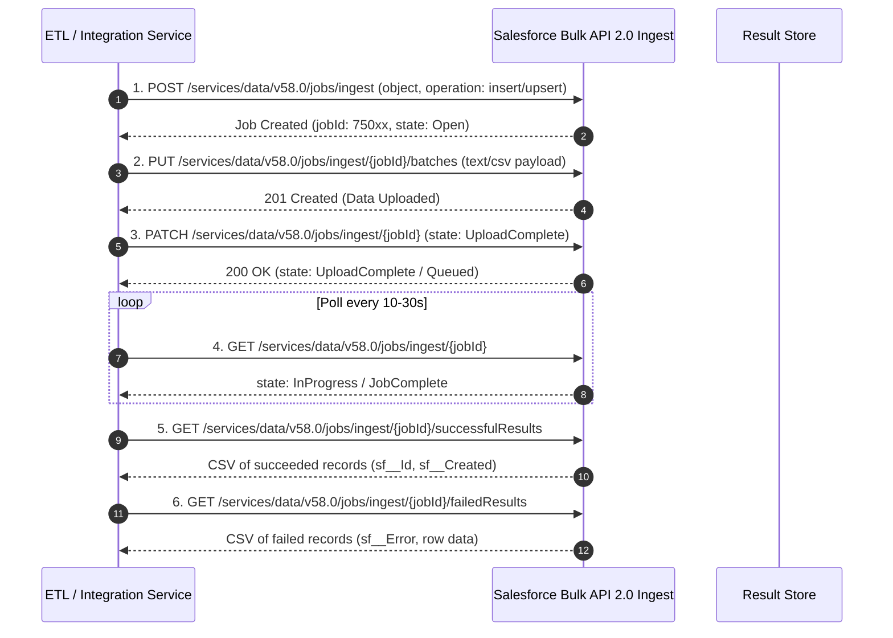

# Salesforce Bulk API 2.0 for High-Volume Ingestion

## 1. Architecture Overview
**Bulk API 2.0** provides asynchronous high-throughput ingestion and query processing for datasets containing hundreds of thousands to tens of millions of records. Unlike Bulk API 1.0 (which required clients to manually slice records into 10,000-row batches), Bulk API 2.0 accepts a single stream or CSV file up to 150 MB (or 100 million records), and Salesforce automatically handles server-side partitioning, parallel execution, and batch optimization.



---

## 2. API Operations Matrix

| Operation | HTTP Verb & URI | Purpose | Key Header / Body Params |
|---|---|---|---|
| **Create Job** | `POST /services/data/v58.0/jobs/ingest` | Initializes ingest job metadata | `{"object": "Account", "operation": "upsert", "externalIdFieldName": "ERP_Customer_ID__c"}` |
| **Upload Data** | `PUT /services/data/v58.0/jobs/ingest/{jobId}/batches` | Streams raw CSV data | `Content-Type: text/csv` |
| **Close Job** | `PATCH /services/data/v58.0/jobs/ingest/{jobId}` | Signals data upload completion | `{"state": "UploadComplete"}` |
| **Check Status** | `GET /services/data/v58.0/jobs/ingest/{jobId}` | Checks job state and record metrics | Returns `numberRecordsProcessed`, `numberRecordsFailed` |
| **Get Failures** | `GET /services/data/v58.0/jobs/ingest/{jobId}/failedResults` | Retrieves error descriptions per row | Returns CSV with `sf__Id` and `sf__Error` columns |

---

## 3. Production Python Bulk 2.0 Ingestion Pipeline

```python
import io
import time
import requests
import pandas as pd

class SalesforceBulkIngestClient:
    def __init__(self, instance_url: str, access_token: str, api_version: str = "v58.0"):
        self.base_url = f"{instance_url}/services/data/{api_version}/jobs/ingest"
        self.headers = {
            "Authorization": f"Bearer {access_token}",
            "Content-Type": "application/json"
        }

    def create_upsert_job(self, sobject: str, external_id_field: str) -> str:
        payload = {
            "object": sobject,
            "operation": "upsert",
            "externalIdFieldName": external_id_field,
            "contentType": "CSV",
            "lineEnding": "LF"
        }
        resp = requests.post(self.base_url, json=payload, headers=self.headers, timeout=15)
        resp.raise_for_status()
        return resp.json()["id"]

    def upload_csv_data(self, job_id: str, csv_data: str) -> None:
        upload_url = f"{self.base_url}/{job_id}/batches"
        headers = {
            "Authorization": self.headers["Authorization"],
            "Content-Type": "text/csv"
        }
        resp = requests.put(upload_url, data=csv_data.encode("utf-8"), headers=headers, timeout=60)
        resp.raise_for_status()

    def close_job(self, job_id: str) -> None:
        close_url = f"{self.base_url}/{job_id}"
        resp = requests.patch(close_url, json={"state": "UploadComplete"}, headers=self.headers, timeout=15)
        resp.raise_for_status()

    def wait_for_completion(self, job_id: str, poll_interval: int = 15, timeout_sec: int = 1800) -> dict:
        start_time = time.time()
        job_url = f"{self.base_url}/{job_id}"

        while time.time() - start_time < timeout_sec:
            resp = requests.get(job_url, headers=self.headers, timeout=15)
            resp.raise_for_status()
            data = resp.json()
            state = data["state"]

            if state in ("JobComplete", "Failed", "Aborted"):
                return data

            time.sleep(poll_interval)

        raise TimeoutError(f"Bulk job {job_id} exceeded execution timeout of {timeout_sec}s")

    def get_failed_results(self, job_id: str) -> pd.DataFrame:
        failures_url = f"{self.base_url}/{job_id}/failedResults"
        headers = {"Authorization": self.headers["Authorization"], "Accept": "text/csv"}
        resp = requests.get(failures_url, headers=headers, timeout=30)
        resp.raise_for_status()
        return pd.read_csv(io.StringIO(resp.text))
```

---

## 4. Concurrency, Row Locks and Architectural Optimization

* **Parent-Record Locking (`UNABLE_TO_LOCK_ROW`)**: When inserting child records (such as `Contact` or `OpportunityLineItem`) pointing to the same parent `Account` or `Opportunity`, Salesforce locks the parent record to recalculate rollup summaries and sharing rules.
  * *Mitigation*: Pre-sort the ingestion CSV dataset by parent ID so rows referencing the same parent are grouped into the same chunk rather than processed across parallel threads.
* **Bulk Daily Ingestion Limits**:
  * Salesforce imposes a rolling 24-hour limit of **15,000 ingest jobs** and **150 MB total upload size per job**.
  * Prefer larger aggregated uploads over frequent micro-batch jobs.
* **PK Chunking for Bulk Queries**: When extracting multi-million row tables via Bulk 2.0 Query (`/services/data/vXX.X/jobs/query`), enable primary key (PK) chunking for tables over 10 million rows to partition the query by Record ID ranges and avoid timeout exceptions.
