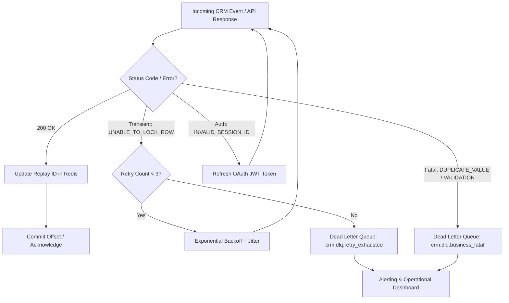

# Error Handling, Replay IDs, and Dead Letter Queues

## 1. Salesforce Integration Error Taxonomy

| Error Code | Category | Root Cause | Handling Strategy |
|---|---|---|---|
| `UNABLE_TO_LOCK_ROW` | Concurrency / Transient | Multiple threads modifying same parent or record during trigger/rollup execution | Exponential backoff with random jitter (retry up to 3 times); sort batch payloads by parent ID |
| `REQUEST_LIMIT_EXCEEDED` | Governance / Throttling | 24-hour API call limit consumed by organization | Fail fast, trip circuit breaker, alert integration team, throttle non-critical queues |
| `INVALID_SESSION_ID` | Authentication | Access token expired or revoked | Invalidate local token cache, execute OAuth 2.0 JWT re-authentication, replay request |
| `CONCURRENT_REQUEST_LIMIT` | Concurrency | More than 25 long-running (>5s) synchronous API requests in flight | Implement client-side rate limiting (leaky bucket) and shift workloads to Bulk API 2.0 |
| `DUPLICATE_VALUE` | Data Integrity / Fatal | Unique external ID constraint or active duplicate rule triggered | Route to Dead Letter Queue (DLQ) for human triage or reconciliation matching |
| `FIELD_CUSTOM_VALIDATION_EXCEPTION` | Business Logic / Fatal | Apex trigger or validation rule rejected field values | Non-retryable; route to DLQ with full payload and error description |

---

## 2. DLQ & Replay Architecture



---

## 3. Transient Error Handling with Exponential Backoff & Jitter (Python)

```python
import time
import random
import logging
import requests

logger = logging.getLogger("salesforce_client")

def execute_with_salesforce_retry(api_func, max_retries: int = 3, base_delay: float = 1.0):
    """
    Executes a Salesforce API function with exponential backoff and decorrelated jitter
    for transient concurrency errors (e.g. UNABLE_TO_LOCK_ROW).
    """
    attempt = 0
    while True:
        attempt += 1
        try:
            return api_func()
        except requests.exceptions.HTTPError as err:
            status = err.response.status_code
            error_text = err.response.text

            # Check if error is transient
            is_transient = (
                status in (429, 503) or
                "UNABLE_TO_LOCK_ROW" in error_text or
                "CONCURRENT_REQUEST_LIMIT" in error_text
            )

            if is_transient and attempt <= max_retries:
                # Exponential backoff + full jitter to prevent thundering herd
                delay = (base_delay * (2 ** (attempt - 1))) + random.uniform(0.1, 0.5)
                logger.warning(f"Salesforce transient error (attempt {attempt}/{max_retries}). Retrying in {delay:.2f}s: {error_text}")
                time.sleep(delay)
                continue

            # Non-transient or exhausted retries
            logger.error(f"Salesforce non-retryable error or retries exhausted: {status} - {error_text}")
            raise
```

---

## 4. Replay ID Recovery Pattern for Streaming Events

Salesforce Platform Events and Change Data Capture retain events for **72 hours** in the high-volume event bus.

### Replay Policy Options:
* `-1` (**Tip**): Deliver only new events published after subscription connects.
* `-2` (**Earliest**): Deliver all events retained in the 72-hour bus buffer.
* Specific `replayId` integer: Replay all events published after this exact event ID.

### Resilient Subscription Workflow:
1. **Durable Store**: Persist the `replayId` of each processed event to Redis or DynamoDB immediately following successful downstream database commitment.
2. **Crash Recovery**: When restarting the subscription worker, retrieve the last committed `replayId` from Redis and pass it in the Bayeux handshake/subscription header.
3. **Gap Detection**: If Salesforce responds with `400::Error 400:replayId <id> is too old`, the consumer has lagged past the 72-hour retention window. The worker must trigger an initial full-table reconciliation before resuming streaming.
