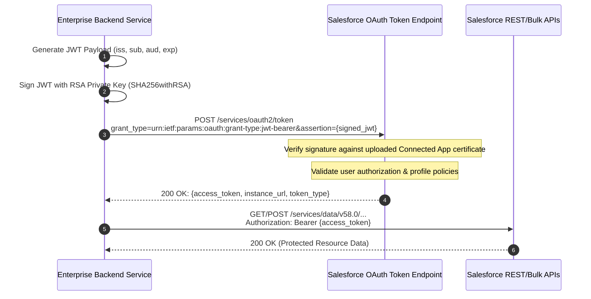

# Identity Federation and OAuth 2.0 JWT Bearer Flow

## 1. Architecture Overview
For unattended server-to-server (daemon/microservice) integrations with Salesforce, the **OAuth 2.0 JWT Bearer Token Flow** (RFC 7523) is the enterprise standard. It eliminates stored user passwords and interactive browser prompts by using asymmetric cryptography (X.509 certificates and RSA private keys).



---

## 2. Connected App Configuration & Security Hardening

To establish trust between the external client and Salesforce:
1. **Digital Certificate Generation**: Generate an RSA key pair (minimum 2048-bit, recommended 4096-bit):
   ```bash
   openssl req -x509 -sha256 -nodes -days 730 -newkey rsa:4096 \
     -keyout salesforce_jwt_private.key \
     -out salesforce_jwt_cert.crt \
     -subj "/CN=enterprise-integration/O=Company/C=US"
   ```
2. **Connected App Setup**:
   - Enable OAuth Settings and check **Use digital signatures**.
   - Upload `salesforce_jwt_cert.crt`.
   - Add OAuth Scopes: `api` (Access and manage your data), `refresh_token, offline_access` (if applicable).
3. **Pre-Authorization & Execution Policies**:
   - Set **Permitted Users** to `Admin approved users are pre-authorized` (never "All users may self-authorize" for server daemons).
   - Under Manage Profiles/Permission Sets, assign the dedicated Integration System User profile.
   - Configure **IP Relaxation** according to network security posture: `Enforce IP restrictions` or `Relax IP restrictions with continuous monitoring`.

---

## 3. JWT Claims Specification

| Claim | Key | Description | Example Value |
|---|---|---|---|
| Issuer | `iss` | The Consumer Key (Client ID) from the Connected App | `3MVG9...sample_consumer_key` |
| Subject | `sub` | The username of the dedicated Salesforce integration user | `svc-integration@company.com` |
| Audience | `aud` | The login URL (`https://login.salesforce.com` for Prod, `https://test.salesforce.com` for Sandbox) | `https://login.salesforce.com` |
| Expiration | `exp` | Unix timestamp in seconds; maximum validity allowed is 5 minutes (300 seconds) | `int(time.time()) + 180` |

---

## 4. Production Python JWT Authentication Client

```python
import time
import requests
import jwt  # PyJWT with cryptography
from datetime import datetime, timedelta, timezone

class SalesforceJWTClient:
    def __init__(self, consumer_key: str, username: str, private_key_path: str, is_sandbox: bool = False):
        self.consumer_key = consumer_key
        self.username = username
        self.private_key_path = private_key_path
        self.auth_url = "https://test.salesforce.com" if is_sandbox else "https://login.salesforce.com"
        self._access_token = None
        self._instance_url = None
        self._token_expiry = datetime.now(timezone.utc)

    def _read_private_key(self) -> str:
        with open(self.private_key_path, "r") as f:
            return f.read()

    def _generate_jwt_assertion(self) -> str:
        now = int(time.time())
        payload = {
            "iss": self.consumer_key,
            "sub": self.username,
            "aud": self.auth_url,
            "exp": now + 180  # Valid for 3 minutes
        }
        private_key = self._read_private_key()
        return jwt.encode(payload, private_key, algorithm="RS256")

    def get_access_token(self, force_refresh: bool = False) -> tuple[str, str]:
        """Returns (access_token, instance_url), refreshing automatically if expired."""
        if not force_refresh and self._access_token and datetime.now(timezone.utc) < self._token_expiry:
            return self._access_token, self._instance_url

        assertion = self._generate_jwt_assertion()
        token_endpoint = f"{self.auth_url}/services/oauth2/token"

        response = requests.post(
            token_endpoint,
            data={
                "grant_type": "urn:ietf:params:oauth:grant-type:jwt-bearer",
                "assertion": assertion
            },
            headers={"Content-Type": "application/x-www-form-urlencoded"},
            timeout=10
        )

        if response.status_code != 200:
            raise RuntimeError(f"Salesforce JWT auth failed: {response.status_code} - {response.text}")

        data = response.json()
        self._access_token = data["access_token"]
        self._instance_url = data["instance_url"]
        # Salesforce access tokens typically last 2 hours; set local refresh buffer to 90 minutes
        self._token_expiry = datetime.now(timezone.utc) + timedelta(minutes=90)

        return self._access_token, self._instance_url
```

---

## 5. Token Lifecycle, Rotation & Fault Handling

* **Clock Drift Sensitivity**: Ensure NTP time synchronization on host nodes. If host clock is ahead of Salesforce servers, Salesforce returns `invalid_grant: expired assertion`.
* **Zero Secret Storage**: Never commit private keys to version control. Load keys from AWS Secrets Manager, HashiCorp Vault, or Azure Key Vault at runtime.
* **Certificate Rotation**:
  1. Generate new RSA key pair and public certificate 30 days before expiration.
  2. Upload new certificate to Salesforce Connected App (Salesforce allows secondary certificate during transition).
  3. Deploy private key to consumer services.
  4. Verify successful token exchange, then remove old certificate from Salesforce.
