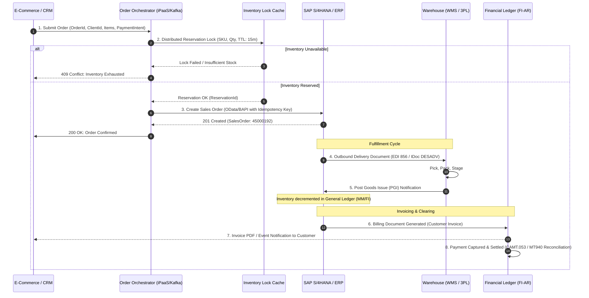

# Order-to-Cash (O2C) Integration Architecture

## 1. Architectural Overview
The **Order-to-Cash (O2C)** integration pipeline is the foundational revenue backbone of enterprise commerce. It orchestrates customer intent across front-end touchpoints (E-Commerce, CRM, Mobile Apps, EDI), intermediate OMS (Order Management Systems), core ERP (SAP S/4HANA, Oracle ERP), Warehouse Management Systems (WMS), and financial ledgers.

Architectural excellence in O2C requires solving three hard problems:
1. **High-Concurrency Inventory Reservation**: Preventing over-allocation when multiple customer carts check out concurrently.
2. **End-to-End Idempotency**: Ensuring transient network drops or retries do not generate duplicate sales orders or billing documents.
3. **Event-Driven Asynchronous Decoupling**: Shielding front-end checkout latency from slow ERP transactional locks.

---

## 2. End-to-End O2C Process Flow



---

## 3. Distributed Idempotency Pattern

To guarantee that duplicate HTTP POST requests from front-end checkouts never create multiple ERP sales orders:

1. **Deterministic Idempotency Key**:
   The client calculates a UUID derived from the channel order reference:
   $$\text{Idempotency-Key} = \text{UUIDv5}(\text{Namespace\_OID}, \text{ChannelOrderId})$$
2. **Ingress Deduplication Store**:
   The integration gateway evaluates the key against Redis with a 24-hour TTL before hitting the ERP:
   ```python
   import redis
   import json

   r = redis.Redis(host="redis-cluster.internal", port=6379, db=0)

   def process_order_with_idempotency(order_payload: dict, idempotency_key: str):
       # Set NX (set if not exists) with 86400s (24h) TTL
       acquired = r.set(f"idemp:order:{idempotency_key}", "IN_PROGRESS", nx=True, ex=86400)

       if not acquired:
           status = r.get(f"idemp:order:{idempotency_key}").decode("utf-8")
           if status == "IN_PROGRESS":
               raise RuntimeError("Order is currently being processed by another worker. Retry shortly.")
           # Return cached success response
           return json.loads(status)

       try:
           # Call ERP Sales Order API
           erp_order_response = call_sap_sales_order_api(order_payload)

           # Cache successful response for idempotent replays
           r.set(f"idemp:order:{idempotency_key}", json.dumps(erp_order_response), ex=86400)
           return erp_order_response
       except Exception as e:
           # Delete key on transient failure so retry can proceed
           r.delete(f"idemp:order:{idempotency_key}")
           raise e
   ```

---

## 4. Key Failure Modes and Operational Break Reconciliation

| O2C Stage | Failure Scenario | Impact | Automated Resolution / Architecture Control |
|---|---|---|---|
| **Order Placement** | Front-end captured credit card auth, but ERP call times out | Customer charged without ERP order creation | Saga Compensating Transaction: OMS automatically voids payment auth if ERP creation fails after 3 retries |
| **Inventory Allocation** | High-velocity flash sale causes overselling before ERP sync | Orders placed for out-of-stock items | Distributed two-phase reservation in Redis cache; ERP acts as final settlement of record |
| **Credit Evaluation** | Corporate buyer credit limit exceeded during ERP insertion | Order placed in `CREDIT_BLOCK` status | Event published to Credit Team inbox; OMS notifies customer with pending review state |
| **Goods Issue (PGI)** | WMS inventory mismatch prevents Goods Issue posting | Revenue cannot be recognized; shipment blocked | Inventory cycle count break raised; alert sent to WMS / ERP reconciliation queue |
| **Invoice Clearing** | Bank settlement amount does not match customer invoice amount | Open balance remains in Accounts Receivable | Payment break workflow: tolerances < $1.00 auto-cleared to fee account; > $1.00 routed to AR analyst |

---

## 5. Architectural Quality Checklist
- [ ] Implement transactional Outbox pattern in OMS to decouple checkout HTTP responses from ERP queue ingestion.
- [ ] Mandate distinct business correlation IDs (`X-Correlation-ID`) across checkout, OMS, SAP S/4HANA, and WMS.
- [ ] Enforce asynchronous messaging (Kafka / RabbitMQ) between OMS and ERP for order creation to absorb ERP maintenance windows.
- [ ] Maintain an automated reconciliation job comparing daily closed OMS orders against ERP sales order documents.
