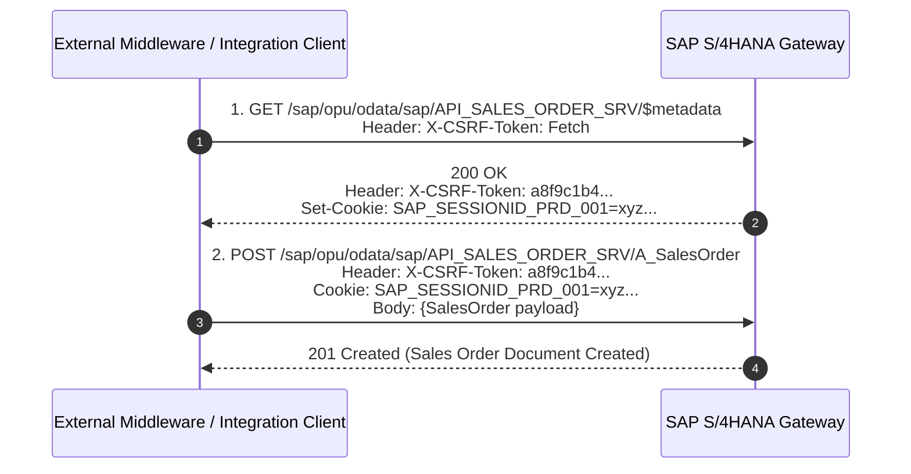

# SAP OData Protocol: v2 vs. v4, Batching, and CSRF Protection

## 1. Architectural Overview
Open Data Protocol (OData) is the primary RESTful communication standard for modern SAP architectures, including SAP S/4HANA Cloud, S/4HANA On-Premise, and SAP Business Technology Platform (BTP).

SAP systems expose transactional and master data through OData Entity Data Models (EDM). Mutating operations (`POST`, `PUT`, `PATCH`, `DELETE`) require explicit session-bound CSRF token validation, and multi-entity operations rely on multipart MIME `$batch` envelopes for atomic execution.

---

## 2. SAP OData v2 vs. OData v4 Comparison

| Capability | OData v2 (SAP Gateway Classic) | OData v4 (SAP S/4HANA Modern) | Architectural Impact |
|---|---|---|---|
| **Payload Format** | Verbose JSON (wrapped in `{"d": { ... }}`) or XML | Lean JSON (ISO 8601 timestamps, unwrapped root) | 30–40% smaller network payloads with v4 |
| **Navigation & Expand** | Single-level or comma-separated `$expand=to_Item` | Nested queries: `$expand=to_Item($select=Material,Qty)` | Drastically reduces over-fetching of child entities |
| **Batching Mechanism** | Multipart MIME only (`multipart/mixed; boundary=...`) | Multipart MIME and JSON Batching support | Easier parsing and client debugging in v4 |
| **Paging** | `$top`, `$skip`, `$skiptoken` | `$top`, `$skip`, client-driven or server-driven cursor | Better indexing and performance on large CDS views |
| **Draft Handling** | Custom implementation required | Native RAP (RESTful Application Programming) drafts | Out-of-the-box support for long-running business edits |

---

## 3. Two-Step CSRF Token Handshake

SAP Gateway prevents Cross-Site Request Forgery by requiring state-changing operations to present a valid `X-CSRF-Token` coupled with the originating HTTP session cookies (`SAP_SESSIONID_*` or `MYSAPSSO2`).



---

## 4. Atomic Transaction Batching ($batch)

When multiple records must be created or updated atomically (e.g. creating a header order and 50 line items across multiple entity sets), the client posts to the `/$batch` endpoint using `Content-Type: multipart/mixed; boundary=batch_xxx`.

### ChangeSets for Transactional Rollback
* Requests grouped inside a **ChangeSet** (`changeset_xxx`) execute within a single database transaction (`LUW` - Logical Unit of Work).
* If any single operation inside the changeset fails, **all operations within that changeset are rolled back in SAP**.
* Requests outside changesets (e.g., standard `GET` queries) execute independently.

### Raw Multipart $batch Payload Example
```http
POST /sap/opu/odata/sap/API_SALES_ORDER_SRV/$batch HTTP/1.1
Host: s4hana.company.com
Content-Type: multipart/mixed; boundary=batch_order_001
X-CSRF-Token: a8f9c1b4...
Cookie: SAP_SESSIONID_PRD_001=xyz...

--batch_order_001
Content-Type: multipart/mixed; boundary=changeset_001

--changeset_001
Content-Type: application/http
Content-Transfer-Encoding: binary

POST A_SalesOrder HTTP/1.1
Content-Type: application/json
Content-ID: 1

{
  "SalesOrderType": "OR",
  "SalesOrganization": "1000",
  "DistributionChannel": "10",
  "OrganizationDivision": "00",
  "SoldToParty": "1000001"
}

--changeset_001
Content-Type: application/http
Content-Transfer-Encoding: binary

POST $1/to_Item HTTP/1.1
Content-Type: application/json

{
  "Material": "MAT-A100",
  "RequestedQuantity": "10",
  "RequestedQuantityUnit": "EA"
}

--changeset_001--
--batch_order_001--
```

---

## 5. Production Python OData Client with $batch Support

```python
import uuid
import requests

class SAPODataClient:
    def __init__(self, base_url: str, auth_token: str):
        self.base_url = base_url.rstrip('/')
        self.auth_token = auth_token
        self.session = requests.Session()
        self.csrf_token = None

    def fetch_csrf_token(self) -> str:
        """Fetches and caches the CSRF token and session cookies from SAP Gateway."""
        headers = {
            "Authorization": f"Bearer {self.auth_token}",
            "X-CSRF-Token": "Fetch",
            "X-Requested-With": "XMLHttpRequest"
        }
        resp = self.session.get(f"{self.base_url}/$metadata", headers=headers, timeout=10)
        resp.raise_for_status()
        self.csrf_token = resp.headers.get("X-CSRF-Token")
        return self.csrf_token

    def execute_batch(self, batch_payload: str, batch_boundary: str) -> str:
        """Executes a multipart MIME $batch request ensuring valid CSRF authentication."""
        if not self.csrf_token:
            self.fetch_csrf_token()

        headers = {
            "Authorization": f"Bearer {self.auth_token}",
            "Content-Type": f"multipart/mixed; boundary={batch_boundary}",
            "X-CSRF-Token": self.csrf_token,
            "X-Requested-With": "XMLHttpRequest"
        }

        resp = self.session.post(
            f"{self.base_url}/$batch",
            data=batch_payload,
            headers=headers,
            timeout=30
        )

        # If token expired on server, refresh once and retry
        if resp.status_code == 403 and resp.headers.get("X-CSRF-Token") == "Required":
            self.fetch_csrf_token()
            headers["X-CSRF-Token"] = self.csrf_token
            resp = self.session.post(
                f"{self.base_url}/$batch",
                data=batch_payload,
                headers=headers,
                timeout=30
            )

        resp.raise_for_status()
        return resp.text
```

---

## 6. Architectural Best Practices for SAP OData
* **Session Sticky Routing**: Ensure application load balancers and reverse proxies enable session affinity (cookie-based stickiness) for SAP Gateway web dispatchers so the CSRF handshake cookie matches the mutating request node.
* **Avoid Chatty CRUD Calls**: Use Deep Insert (inserting header and child items in a single JSON payload) or `$batch` ChangeSets to minimize network latency and round trips.
* **Delta Token Synchronization**: For data extraction pipelines, utilize OData delta links (`@odata.deltaLink`) so subsequent pulls only retrieve entities modified since the last synchronization marker.
