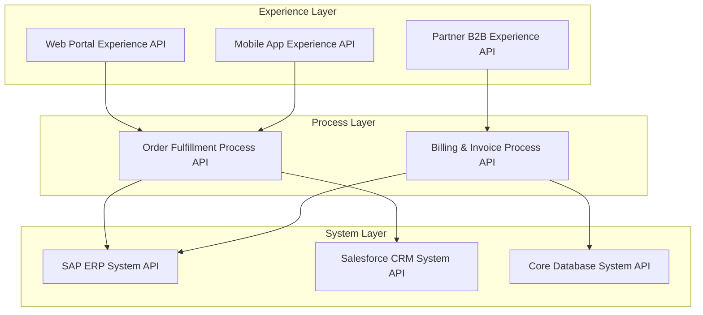

# Enterprise Integration: Hybrid & Multi-Cloud Integration Architecture

## 1. Architectural Purpose & Problem Context
Bridging on-premises legacy data centers with multi-cloud workloads: dedicated interconnects (Direct Connect / ExpressRoute), reverse proxies, and mTLS.

---

## 2. API-Led 3-Tier Integration Architecture

---

## 3. Production Invariants
- Avoid building monolithic centralized ESB bottlenecks where business logic is trapped inside proprietary integration bus scripts.
- Enforce strict layer boundaries: Experience APIs must never bypass the Process layer to directly query backend databases.
